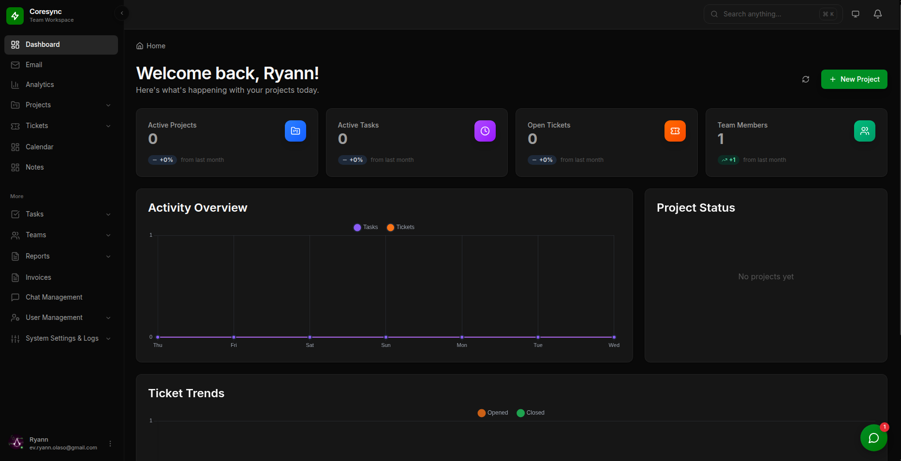
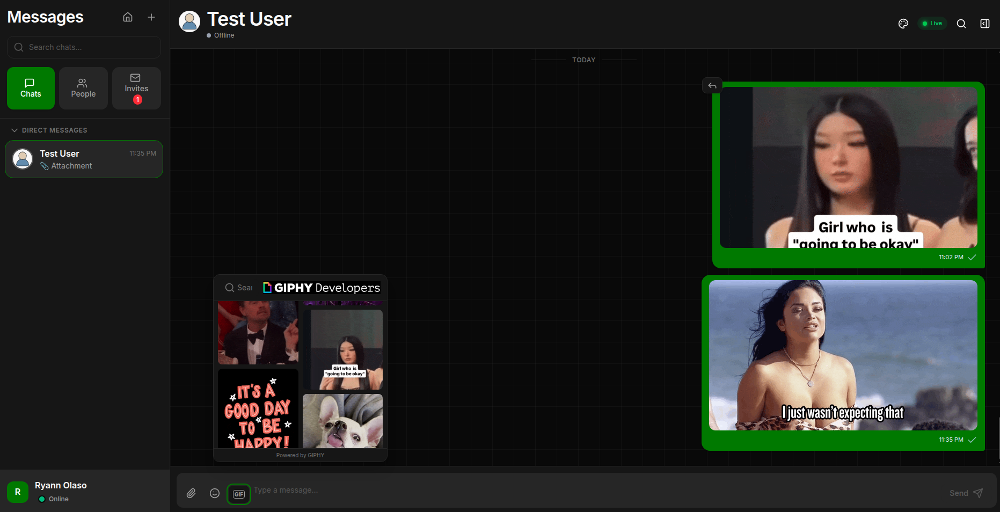
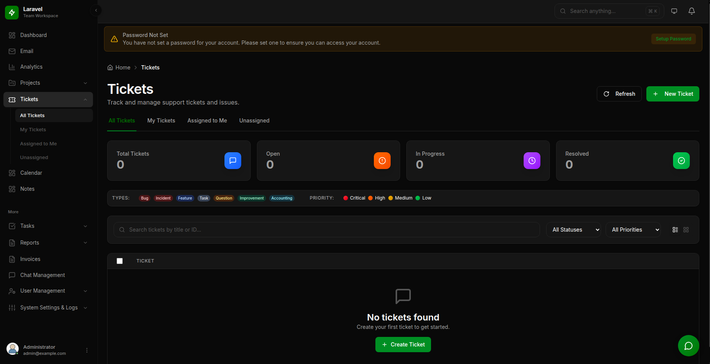
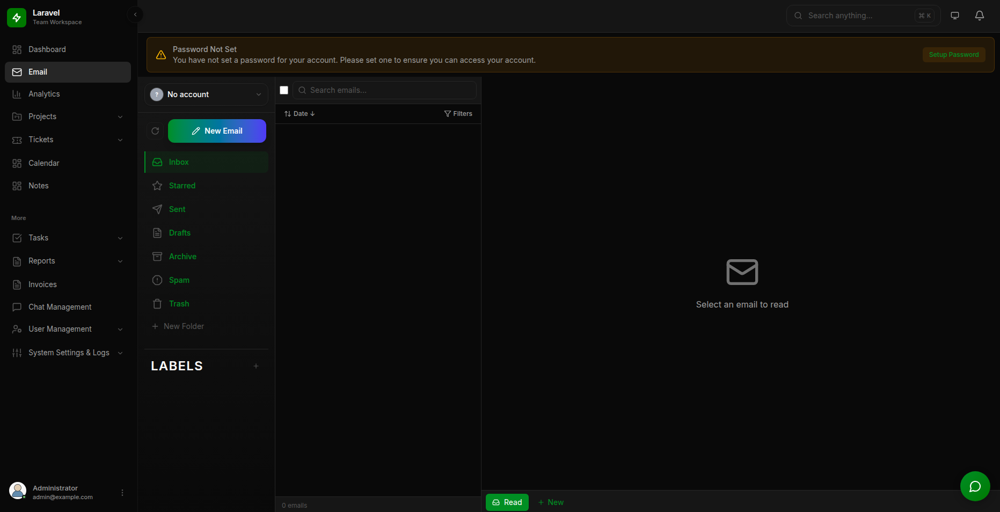
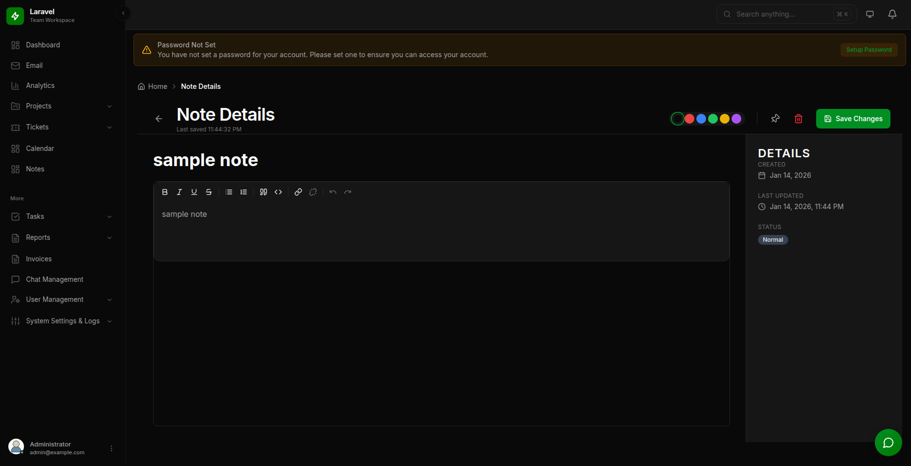
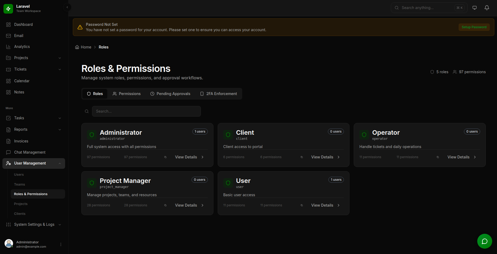
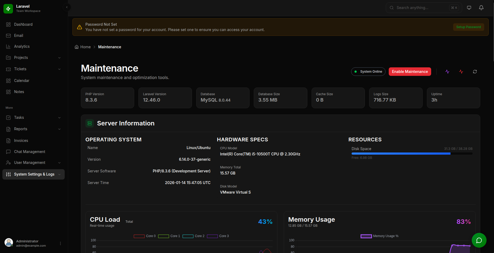

# WorkSphere

<p align="center">
<a href="https://laravel.com" target="_blank"></a>
</p>

> [!WARNING]
> **BETA RELEASE NOTICE**
> WorkSphere is currently in active **BETA** development. Features are subject to change, and you may encounter bugs or instability.
> NOT RECOMMENDED FOR PRODUCTION USE without extensive testing.

## Overview

WorkSphere is a comprehensive enterprise **Single Page Application (SPA)** built on **Laravel 12** and **Vue 3**. It functions as a "Super App," integrating multiple core business modules into a unified, real-time interface.

## Technology Stack

### Backend

- **Framework**: Laravel 12.x
- **Real-time**: Laravel Reverb (WebSocket)
- **Database**: MySQL 8.x + Redis (Cache/Queue)
- **Search**: Database (via Laravel Scout)
- **Authentication**: Laravel Fortify (Session) + Sanctum (API) + Socialite (OAuth)
- **Key Packages**: `spatie/laravel-permission`, `spatie/media-library`, `webklex/laravel-imap`

### Frontend

- **Framework**: Vue 3.5 (Composition API)
- **State Management**: Pinia
- **Styling**: Tailwind CSS 4.0 + Reka UI
- **Build Tool**: Vite 6.0
- **Key Libraries**: `tiptap` (Rich Text), `fullcalendar` (Events), `chart.js` (Analytics), `laravel-echo` (Real-time)

## Core Features & Modules

### Dashboard

_Central hub for personal stats, tasks, and system overview._


### Real-time Chat System

_Full-featured messaging with groups, file sharing, and typing indicators._


### Project Management & Calendar

_Task tracking, Kanban boards, and integrated calendar scheduling._


### Ticket System

_Internal support ticketing with automated workflows._


### Unified Email Client

_IMAP/SMTP inbox with folder management and rich text composition._


### Analytics

_Visual insights and reporting._


### Personal Notes

_Markdown-supported personal note-taking app._


### Team & User Management

_Role-based access control (RBAC), team management, and user profiles._



### System Maintenance

_System health monitoring, queue management, and backups._


## Installation & Setup

1. **Clone the repository**

    ```bash
    git clone git@github.com:SummerRijndael/worksphere.git
    cd worksphere
    ```

2. **Install Dependencies**

    ```bash
    composer install
    npm install
    ```

3. **Environment Setup**

    ```bash
    cp .env.example .env
    php artisan key:generate
    ```

    > **Note:** The `.env` file contains critical sensitive information. Never commit it to version control. Use `.env.example` as a template.

4. **Configure External Services**

    Open your `.env` file and populate the necessary service credentials.

    ### Real-time (Laravel Reverb)

    WorkSphere uses Laravel Reverb for real-time WebSocket communication (chat, notifications, presence).

    ```ini
    REVERB_APP_ID=my-app-id
    REVERB_APP_KEY=my-app-key
    REVERB_APP_SECRET=my-app-secret
    REVERB_HOST="localhost"
    REVERB_PORT=8080
    REVERB_SCHEME=http
    ```

    ### Social Auth & Integrations

    **Google Calendar Sync:**
    You must enable the **Google Calendar API** in your Google Cloud Console and add the following redirect URI:
    `http://127.0.0.1:8000/callback/calendar`

    ```ini
    GOOGLE_CLIENT_ID=your-google-client-id
    GOOGLE_CLIENT_SECRET=your-google-client-secret
    GOOGLE_REDIRECT_URI="${APP_URL}/auth/google/callback"
    GOOGLE_CALENDAR_REDIRECT_URI="${APP_URL}/callback/calendar"
    ```

    ### Security (reCAPTCHA)

    The system supports both V2 (Checkbox) and V3 (Invisible) reCAPTCHA.

    ```ini
    RECAPTCHA_ENABLED=true
    RECAPTCHA_V3_SITE_KEY=...
    RECAPTCHA_V3_SECRET_KEY=...
    ```

    ### Giphy Integration

    To enable Giphy support in Chat, obtain an API key from the [Giphy Developers Portal](https://developers.giphy.com/).

    ```ini
    GIPHY_API_KEY=your-giphy-api-key
    ```

    ### Other Integrations

    The system relies on several external services for full functionality. Populate these in `.env`:
    - **OpenAI**: Required for AI-powered features. (`OPENAI_API_KEY`, etc.)
    - **Twilio**: Used for SMS notifications and 2FA. (`TWILIO_SID`, `TWILIO_AUTH_TOKEN`, etc.)
    - **AWS S3**: Recommended for production file storage. (`AWS_ACCESS_KEY_ID`, `AWS_BUCKET`, etc.)
    - **MaxMind/GeoIP**: Required for location-based features. (`MAXMIND_LICENSE_KEY`)

5. **Initialize System**

    ```bash
    php artisan migrate --seed
    php artisan storage:link
    ```

6. **Run Application**
    ```bash
    npm run start-all
    ```
    _This command runs Laravel Serve, Reverb, Queue Worker, and Vite concurrently._

Test users
admin@example.com - Xachgamb@01
test@example.com - Xachgamb@01

## Architecture

- **API-First**: The backend serves as a headless API (`routes/api.php`) protected by Sanctum.
- **SPA Frontend**: The Vue app is served via a single entry point (`views/app.blade.php`, `routes/web.php`).
- **Real-time**: Events are broadcasted to private channels (`private-user.{id}`) using Laravel Reverb.
- **Authorization**: Strict Policy and Permission-based access control (RBAC).

## Security

- **Authentication**: Supports Password, Social Login (Google/Microsoft), and 2FA (TOTP/SMS/WebAuthn).
- **Rate Limiting**: Strict throttling on auth endpoints and sensitive actions.
- **Media**: Private uploads are securely served via signed URLs.

## Documentation

For detailed internal documentation, open `worksphere_doc.html` in your browser.

## License

This project is licensed under the **Apache License 2.0**.

Licensed under the Apache License, Version 2.0 (the "License");
you may not use this file except in compliance with the License.
You may obtain a copy of the License at

    http://www.apache.org/licenses/LICENSE-2.0

Unless required by applicable law or agreed to in writing, software
distributed under the License is distributed on an "AS IS" BASIS,
WITHOUT WARRANTIES OR CONDITIONS OF ANY KIND, either express or implied.
See the License for the specific language governing permissions and
limitations under the License.

---

&copy; 2026 WorkSphere. Internal Development.
