<div align="center">
    
    <h1>WorkSphere</h1>
    <p><strong>The Ultimate Enterprise "Super App" for Modern Business Management</strong></p>

<!-- Badges -->
<p>
    <a href="https://github.com/SummerRijndael/worksphere/stargazers">
        
    </a>
    <a href="https://github.com/SummerRijndael/worksphere/blob/main/LICENSE">
        
    </a>
    
    
    
    <br>
    
</p>

<!-- Support -->
<p>
    <a href='https://ko-fi.com/ryannolaso' target='_blank'>
        
    </a>
</p>
</div>

<br/>

<div align="center">
    <h3>🔴 Live Demo: <a href="https://link-technologies.info">link-technologies.info</a></h3>
</div>

<br/>

> [!WARNING]
> **BETA RELEASE NOTICE**<br>
> WorkSphere is currently in active **BETA** development. Features are subject to change, and you may encounter bugs or instability.<br>
> **NOT RECOMMENDED FOR PRODUCTION USE without extensive testing.**

---

## 🚀 Overview

**WorkSphere** is a comprehensive enterprise **Single Page Application (SPA)** built on **Laravel 12** and **Vue 3**. It functions as a centralized "Super App," seamlessly integrating multiple core business modules into a unified, real-time interface designed for efficiency and scalability.

## 🛠️ Technology Stack

| **Backend Core** | **Frontend Ecosystem** |
| :--- | :--- |
|  **Framework** |  **Framework** |
|  **Real-time (WebSocket)** |  **State Management** |
|  **Database** |  **Styling** |
|  **Cache/Queue** |  **Build Tool** |
|  **Security** |  **Real-time Calls** |
| **Authentication:** Fortify + Sanctum + Socialite | **Key Libs:** Tiptap, FullCalendar, Chart.js, sdp-transform |

## ✨ Core Features & Modules


### 🔐 Authentication

*Secure login with social auth, multi-factor authentication (MFA), and role-based access.*


### 📊 Dashboard

*A central hub for personal stats, pending tasks, and a high-level system overview.*
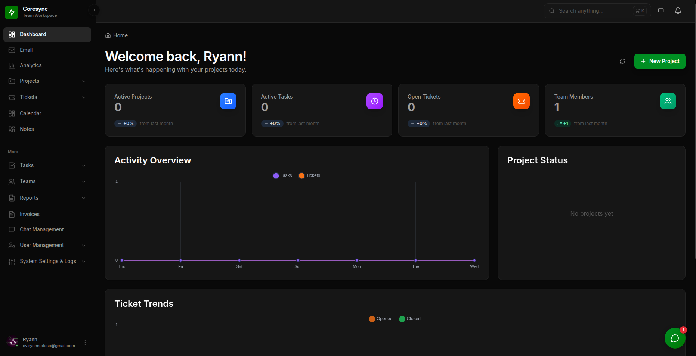


### 💬 Real-time Communication

*Full-featured instant messaging and high-quality voice/video calls.*
- **Messaging**: Groups, file sharing, and typing indicators.
- **Video Calls**: 1:1 and Group video/audio calls with peer-to-peer WebRTC.
- **Hybrid SFU**: Scalable calls using Cloudflare Calls for groups > 6 participants.
- **Screen Sharing**: High-resolution screen sharing support for both 1:1 and group calls.
- **Global Notifications**: Receive call alerts anywhere in the application.

<div style="display: flex; gap: 10px; flex-wrap: wrap;">
    
    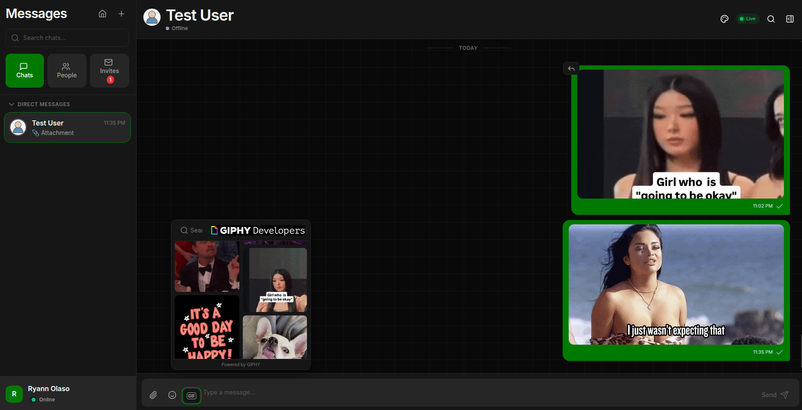
    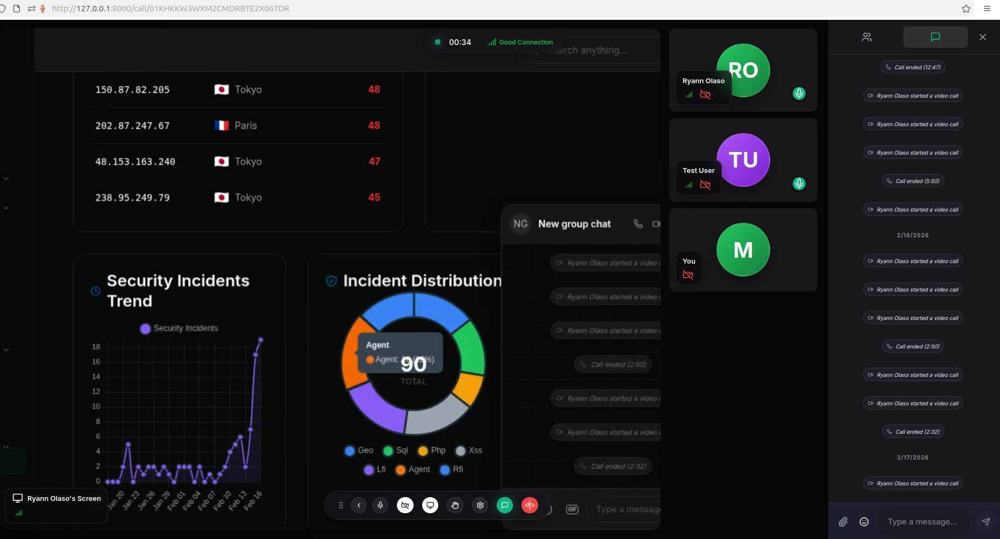
</div>


### 📅 Project Management & Calendar

*Advanced task tracking, Kanban boards, and integrated scheduling.*
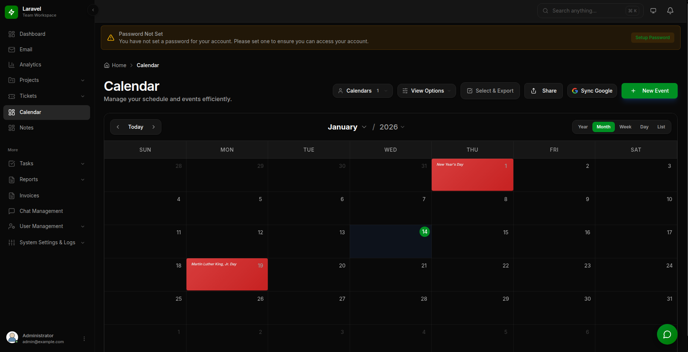


### 🎫 Ticket System

*Internal support ticketing with automated workflows and status tracking.*
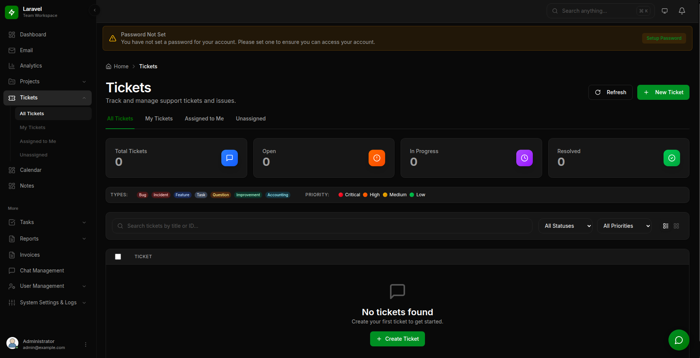


### 📧 Unified Email Client

*IMAP/SMTP inbox with folder management and a rich text editor.*
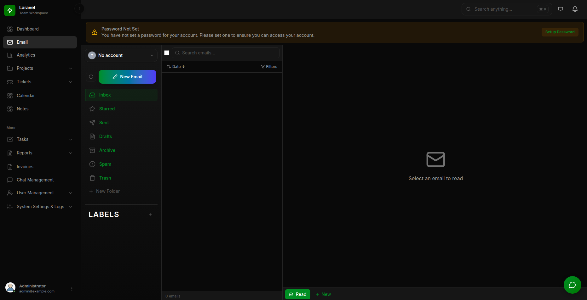


### 📈 Analytics

*Visual insights, reporting, and data visualization.*
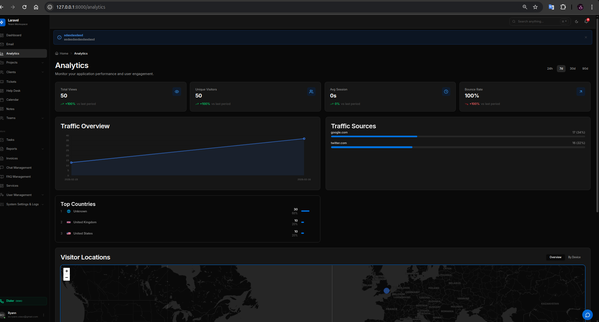


### 📚 Knowledge Base

*Knowledge management system with internal drafts and public article publishing.*


### 📝 Personal Notes

*Markdown-supported personal note-taking app.*
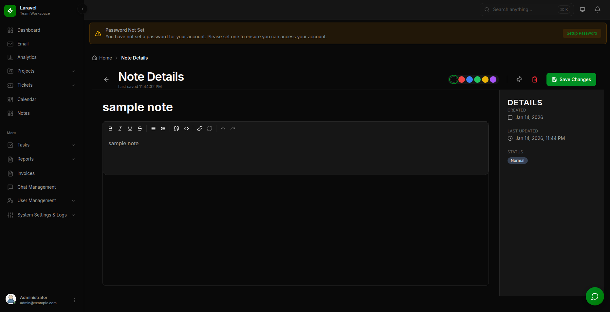


### 👥 Team & User Management

*Granular Role-Based Access Control (RBAC), team management, and user profiles.*
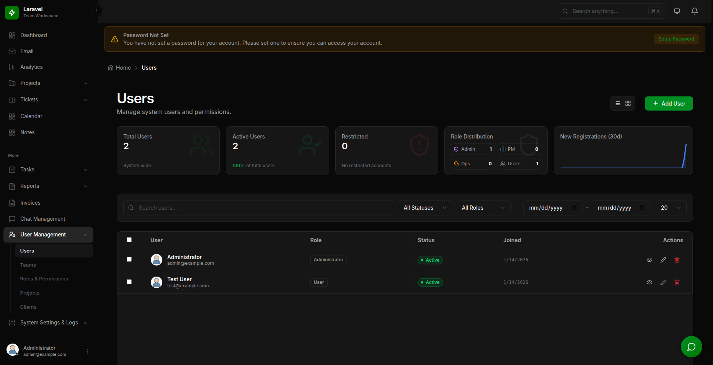

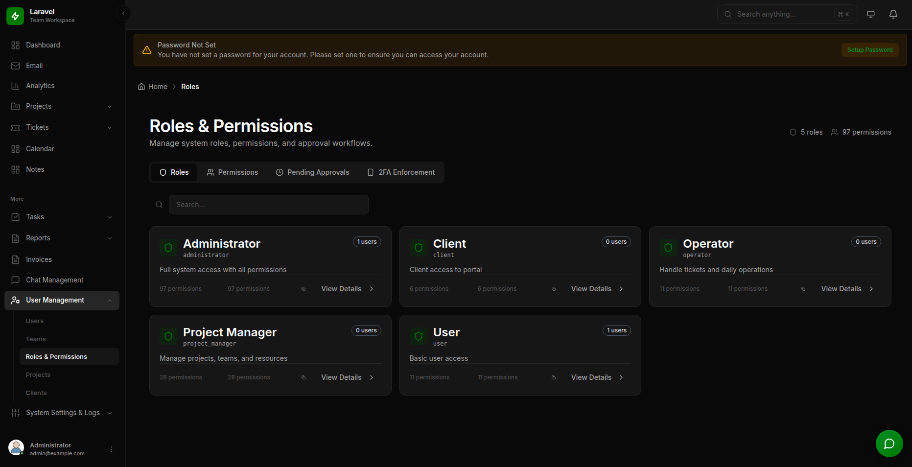


### 🛡️ Security & Firewall

*Real-time threat monitoring, geographical attack visualization, and granular audit logging.*
- **Threat Map**: Live visualization of security incidents across the globe.
- **Firewall Integration**: Manage blocked/whitelisted IPs and monitor system-wide firewall logs.
- **Smart Audit Trails**: Context-aware logging that distinguishes between failure reasons (e.g., "User Not Found" vs. "Incorrect Password").
- **Time-Based Analytics**: Filter security data by arbitrary time periods (24h to 1y) to identify trends.
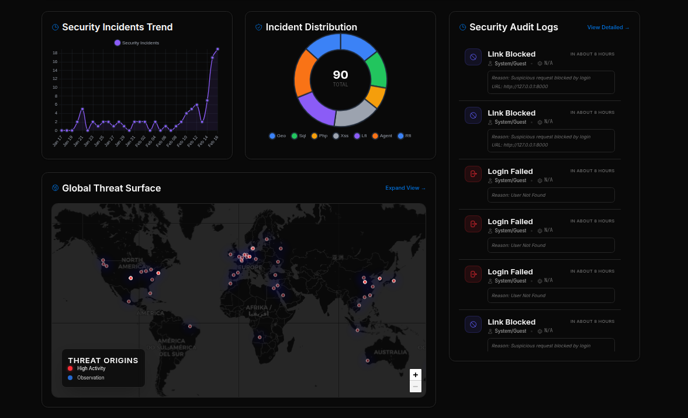


### 🛠️ System Maintenance

*System health monitoring, queue management, and backups.*
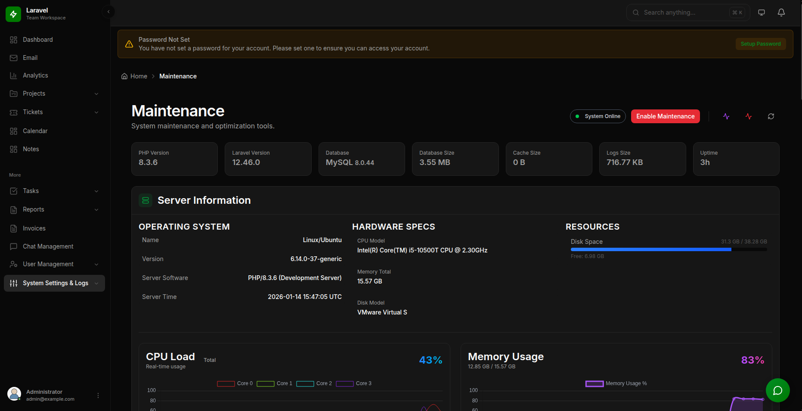

---

## ⚙️ Installation & Setup

### 1. Clone the Repository
```bash
git clone git@github.com:SummerRijndael/worksphere.git
cd worksphere
```

### 2. Install Dependencies
```bash
composer install
npm install
```

### 3. Environment Setup
```bash
cp .env.example .env
php artisan key:generate
```
> [!IMPORTANT]
> The `.env` file contains critical sensitive information. **Never** commit it to version control.

### 4. Configure External Services
Update `REVERB_*`, `GOOGLE_*`, `RECAPTCHA_*`, etc. in your `.env` file.

**Real-time (Laravel Reverb):**
```ini
REVERB_APP_ID=my-app-id
REVERB_APP_KEY=my-app-key
REVERB_APP_SECRET=my-app-secret
REVERB_HOST="localhost"
REVERB_PORT=8080
REVERB_SCHEME=http
```

Required for reliable video calls across different networks.
1. Go to **Cloudflare Dashboard** -> **Calls**.
2. Create a new **TURN App**.
3. Copy the **Key ID** and **API Token** to your `.env`:
```ini
TURN_KEY_ID="your-key-id"
TURN_KEY_API_TOKEN="your-api-token"
```

**Cloudflare SFU (Large Group Calls):**
Required for calls with more than 6 participants and advanced track management.
1. In the same **Cloudflare Calls** dashboard, create a new **App**.
2. Copy the **App ID** and **App Secret** to your `.env`:
```ini
CLOUDFLARE_APP_ID_SFU="your-app-id"
CLOUDFLARE_APP_SECRET_SFU="your-app-secret"
```

### 5. Initialize System
```bash
php artisan migrate --seed
php artisan storage:link
```

### 6. Run Application
```bash
npm run start-all
```
*Runs Laravel Serve, Reverb, Queue Worker, and Vite concurrently.*

---

## 🔑 Test Users

| Role | Email | Password |
| :--- | :--- | :--- |
| **Admin** | `admin@example.com` | `Xachgamb@01` |
| **User** | `test@example.com` | `Xachgamb@01` |

---

## 🏢 Roles & Permissions

WorkSphere uses a multi-layered authorization system:

- **Global Roles**: Powered by `Spatie/Permission` for application-wide access.
- **Team Roles**: Specific permissions within a team (Owner, Admin, Member, etc.).
- **Authorization Persona**: Centralized logic in the backend that resolves all permissions (Global + Team + Overrides) into a single context for efficient checking.
- **Permission Overrides**: Ability to grant or block specific permissions for a user, either permanently or temporarily.

## 🧭 Navigation & Security

- **Route Guards**: Frontend navigation is protected by Vue Router guards checking authentication, email verification, and specific permission requirements (`to.meta.permission`).
- **Permission-Scoped UI**: Components and actions are conditionally rendered based on the user's active permissions.
- **Secure APIs**: All backend endpoints are protected by Laravel Sanctum and fine-grained Policies/Gates.

## 🏛️ Architecture

*   **API-First**: Headless API (`routes/api.php`) protected by Sanctum.
*   **SPA Frontend**: Vue 3 app via single entry point.
*   **Real-time**: Private channel broadcasting via Laravel Reverb.
*   **Authorization**: Strict RBAC Policies.
*   **Service Pattern**: Business logic encapsulated in targeted Services (`app/Services`).

## 📄 License

This project is licensed under the **Apache License 2.0**.

&copy; 2026 WorkSphere. Internal Development.
