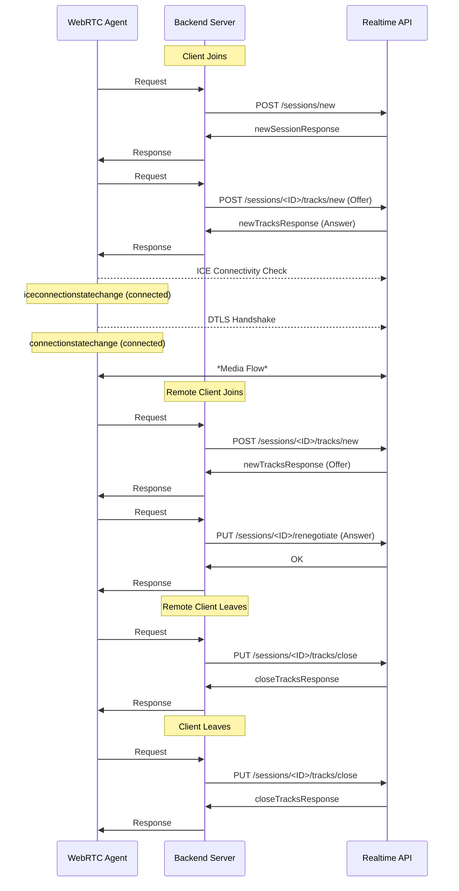
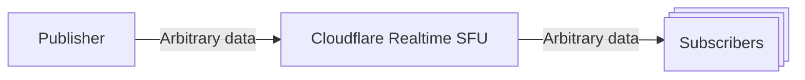
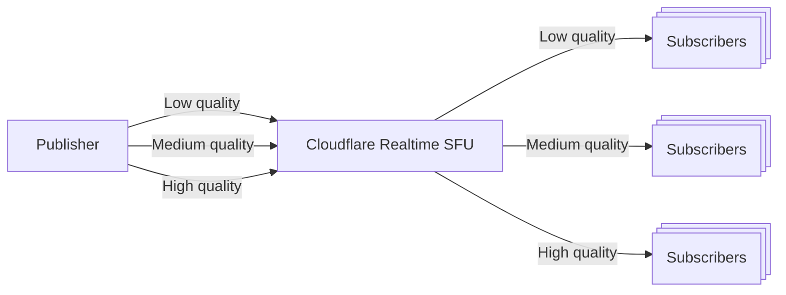

Build real-time serverless video, audio and data applications.

Cloudflare Realtime SFU is infrastructure for real-time audio/video/data applications. It allows you to build real-time apps without worrying about scaling or regions. It can act as a selective forwarding unit (WebRTC SFU), as a fanout delivery system for broadcasting (WebRTC CDN) or anything in between.

Cloudflare Realtime SFU runs on [Cloudflare's global cloud network](https://www.cloudflare.com/network/) in hundreds of cities worldwide.

[Get started](https://developers.cloudflare.com/realtime/sfu/get-started/)

[Realtime dashboard](https://dash.cloudflare.com/?to=/:account/calls)

[Orange Meets demo app](https://github.com/cloudflare/orange)

-

---
title: Introduction · Cloudflare Realtime docs
description: Cloudflare Realtime can be used to add realtime audio, video and
  data into your applications. Cloudflare Realtime uses WebRTC, which is the
  lowest latency way to communicate across a broad range of platforms like
  browsers, mobile, and native apps.
lastUpdated: 2025-08-12T17:36:47.000Z
chatbotDeprioritize: false
source_url:
  html: https://developers.cloudflare.com/realtime/sfu/introduction/
  md: https://developers.cloudflare.com/realtime/sfu/introduction/index.md
---

Cloudflare Realtime can be used to add realtime audio, video and data into your applications. Cloudflare Realtime uses WebRTC, which is the lowest latency way to communicate across a broad range of platforms like browsers, mobile, and native apps.

Realtime integrates with your backend and frontend application to add realtime functionality.

## Why Cloudflare Realtime exists

* **It is difficult to scale WebRTC**: Many struggle scaling WebRTC servers. Operators run into issues about how many users can be in the same "room" or want to build unique solutions that do not fit into the current concepts in high level APIs.

* **High egress costs**: WebRTC is expensive to use as managed solutions charge a high premium on cloud egress and running your own servers incur system administration and scaling overhead. Cloudflare already has 300+ locations with upwards of 1,000 servers in some locations. Cloudflare Realtime scales easily on top of this architecture and can offer the lowest WebRTC usage costs.

* **WebRTC is growing**: Developers are realizing that WebRTC is not just for video conferencing. WebRTC is supported on many platforms, it is mature and well understood.

## What makes Cloudflare Realtime unique

* **Unopinionated**: Cloudflare Realtime does not offer a SDK. It instead allows you to access raw WebRTC to solve unique problems that might not fit into existing concepts. The API is deliberately simple.

* **No rooms**: Unlike other WebRTC products, Cloudflare Realtime lets you be in charge of each track (audio/video/data) instead of offering abstractions such as rooms. You define the presence protocol on top of simple pub/sub. Each end user can publish and subscribe to audio/video/data tracks as they wish.

* **No lock-in**: You can use Cloudflare Realtime to solve scalability issues with your SFU. You can use in combination with peer-to-peer architecture. You can use Cloudflare Realtime standalone. To what extent you use Cloudflare Realtime is up to you.

## What exactly does Cloudflare Realtime do?

* **SFU**: Realtime is a special kind of pub/sub server that is good at forwarding media data to clients that subscribe to certain data. Each client connects to Cloudflare Realtime via WebRTC and either sends data, receives data or both using WebRTC. This can be audio/video tracks or DataChannels.

* **It scales**: All Cloudflare servers act as a single server so millions of WebRTC clients can connect to Cloudflare Realtime. Each can send data, receive data or both with other clients.

## How most developers get started

1. Get started with the echo example, which you can download from the Cloudflare dashboard when you create a Realtime App or from [demos](https://developers.cloudflare.com/realtime/sfu/demos/). This will show you how to send and receive audio and video.

2. Understand how you can manipulate who can receive what media by passing around session and track ids. Remember, you control who receives what media. Each media track is represented by a unique ID. It is your responsibility to save and distribute this ID.

Realtime is not a presence protocol

Realtime does not know what a room is. It only knows media tracks. It is up to you to make a room by saving who is in a room along with track IDs that unique identify media tracks. If each participant publishes their audio/video, and receives audio/video from each other, you have got yourself a video conference!

1. Create an app where you manage each connection to Cloudflare Realtime and the track IDs created by each connection. You can use any tool to save and share tracks. Check out the example apps at [demos](https://developers.cloudflare.com/realtime/sfu/demos/), such as [Orange Meets](https://github.com/cloudflare/orange), which is a full-fledged video conferencing app that uses [Workers Durable Objects](https://developers.cloudflare.com/durable-objects/) to keep track of track IDs.

-

---
title: Quickstart guide · Cloudflare Realtime docs
description: >-
  Every Realtime App is a separate environment, so you can make one for
  development, staging and production versions for your product.

  Either using Dashboard, or the API create a Realtime App. When you create a
  Realtime App, you will get:
lastUpdated: 2026-01-09T04:34:13.000Z
chatbotDeprioritize: false
source_url:
  html: https://developers.cloudflare.com/realtime/sfu/get-started/
  md: https://developers.cloudflare.com/realtime/sfu/get-started/index.md
---

Before you get started:

You must first [create a Cloudflare account](https://developers.cloudflare.com/fundamentals/account/create-account/).

## Create your first app

Every Realtime App is a separate environment, so you can make one for development, staging and production versions for your product. Either using [Dashboard](https://dash.cloudflare.com/?to=/:account/realtime/sfu), or the [API](https://developers.cloudflare.com/api/resources/calls/subresources/sfu/methods/create/) create a Realtime App. When you create a Realtime App, you will get:

* App ID
* App Secret

These two combined will allow you to make API Realtime from your backend server to Realtime.


-

---
title: Sessions and Tracks · Cloudflare Realtime docs
description: "Cloudflare Realtime offers a simple yet powerful framework for
  building real-time experiences. At the core of this system are three key
  concepts: Applications,  Sessions and Tracks. Familiarizing yourself with
  these concepts is crucial for using Realtime."
lastUpdated: 2025-08-12T17:36:47.000Z
chatbotDeprioritize: false
source_url:
  html: https://developers.cloudflare.com/realtime/sfu/sessions-tracks/
  md: https://developers.cloudflare.com/realtime/sfu/sessions-tracks/index.md
---

Cloudflare Realtime offers a simple yet powerful framework for building real-time experiences. At the core of this system are three key concepts: **Applications**, **Sessions** and **Tracks**. Familiarizing yourself with these concepts is crucial for using Realtime.

## Application

A Realtime Application is an environment within different Sessions and Tracks can interact. Examples of this could be production, staging or different environments where you'd want separation between Sessions and Tracks. Cloudflare Realtime usage can be queried at Application, Session or Track level.

## Sessions

A **Session** in Cloudflare Realtime correlates directly to a WebRTC PeerConnection. It represents the establishment of a communication channel between a client and the nearest Cloudflare data center, as determined by Cloudflare's anycast routing. Typically, a client will maintain a single Session, encompassing all communications between the client and Cloudflare.

* **One-to-One Mapping with PeerConnection**: Each Session is a direct representation of a WebRTC PeerConnection, facilitating real-time media data transfer.
* **Anycast Routing**: The client connects to the closest Cloudflare data center, optimizing latency and performance.
* **Unified Communication Channel**: A single Session can handle all types of communication between a client and Cloudflare, ensuring streamlined data flow.

## Tracks

Within a Session, there can be one or more **Tracks**.

* **Tracks map to MediaStreamTrack**: Tracks align with the MediaStreamTrack concept, facilitating audio, video, or data transmission.
* **Globally Unique Ids**: When you push a track to Cloudflare, it is assigned a unique ID, which can then be used to pull the track into another session elsewhere.
* **Available globally**: The ability to push and pull tracks is central to what makes Realtime a versatile tool for real-time applications. Each track is available globally to be retrieved from any Session within an App.

## Realtime as a Programmable "Switchboard"

The analogy of a switchboard is apt for understanding Realtime. Historically, switchboard operators connected calls by manually plugging in jacks. Similarly, Realtime allows for the dynamic routing of media streams, acting as a programmable switchboard for modern real-time communication.

## Beyond "Rooms", "Users", and "Participants"

While many SFUs utilize concepts like "rooms" to manage media streams among users, this approach has scalability and flexibility limitations. Cloudflare Realtime opts for a more granular and flexible model with Sessions and Tracks, enabling a wide range of use cases:

* Large-scale remote events, like 'fireside chats' with thousands of participants.
* Interactive conversations with the ability to bring audience members "on stage."
* Educational applications where an instructor can present to multiple virtual classrooms simultaneously.

### Presence Protocol vs. Media Flow

Realtime distinguishes between the presence protocol and media flow, allowing for scalability and flexibility in real-time applications. This separation enables developers to craft tailored experiences, from intimate calls to massive, low-latency broadcasts.


-

---
title: Realtime vs Regular SFUs · Cloudflare Realtime docs
description: Cloudflare Realtime represents a paradigm shift in building
  real-time applications by leveraging a distributed real-time data plane. It
  creates a seamless experience in real-time communication, transcending
  traditional geographical limitations and scalability concerns. Realtime is
  designed for developers looking to integrate WebRTC functionalities in a
  server-client architecture without delving deep into the complexities of
  regional scaling or server management.
lastUpdated: 2026-01-20T22:26:54.000Z
chatbotDeprioritize: false
source_url:
  html: https://developers.cloudflare.com/realtime/sfu/calls-vs-sfus/
  md: https://developers.cloudflare.com/realtime/sfu/calls-vs-sfus/index.md
---

## Cloudflare Realtime vs. Traditional SFUs

Cloudflare Realtime represents a paradigm shift in building real-time applications by leveraging a distributed real-time data plane. It creates a seamless experience in real-time communication, transcending traditional geographical limitations and scalability concerns. Realtime is designed for developers looking to integrate WebRTC functionalities in a server-client architecture without delving deep into the complexities of regional scaling or server management.

### The Limitations of Centralized SFUs

Selective Forwarding Units (SFUs) play a critical role in managing WebRTC connections by selectively forwarding media streams to participants in a video call. However, their centralized nature introduces inherent limitations:

* **Regional Dependency:** A centralized SFU requires a specific region for deployment, leading to latency issues for global users except for those in proximity to the selected region.

* **Scalability Concerns:** Scaling a centralized SFU to meet global demand can be challenging and inefficient, often requiring additional infrastructure and complexity.

### How is Cloudflare Realtime different?

Cloudflare Realtime addresses these limitations by leveraging Cloudflare's global network infrastructure:

* **Global Distribution Without Regions:** Unlike traditional SFUs, Cloudflare Realtime operates on a global scale without regional constraints. It utilizes Cloudflare's extensive network of over 250 locations worldwide to ensure low-latency video forwarding, making it fast and efficient for users globally.

* **Decentralized Architecture:** There are no dedicated servers for Realtime. Every server within Cloudflare's network contributes to handling Realtime, ensuring scalability and reliability. This approach mirrors the distributed nature of Cloudflare's products such as 1.1.1.1 DNS or Cloudflare's CDN.

Tip

**See it in action:** Explore our [interactive Global SFU visualization](https://realtime-sfu.dev-demos.workers.dev) to see how participants connect to their nearest Cloudflare datacenter and how media flows across the global backbone.

## How Cloudflare Realtime Works

### Establishing Peer Connections

To initiate a real-time communication session, an end user's client establishes a WebRTC PeerConnection to the nearest Cloudflare location. This connection benefits from anycast routing, optimizing for the lowest possible latency.

### Signaling and Media Stream Management

* **HTTPS API for Signaling:** Cloudflare Realtime simplifies signaling with a straightforward HTTPS API. This API manages the initiation and coordination of media streams, enabling clients to push new MediaStreamTracks or request these tracks from the server.

* **Efficient Media Handling:** Unlike traditional approaches that require multiple connections for different media streams from different clients, Cloudflare Realtime maintains a single PeerConnection per client. This streamlined process reduces complexity and improves performance by handling both the push and pull of media through a singular connection.

### Application-Level Management

Cloudflare Realtime delegates the responsibility of state management and participant tracking to the application layer. Developers are empowered to design their logic for handling events such as participant joins or media stream updates, offering flexibility to create tailored experiences in applications.

## Getting Started with Cloudflare Realtime

Integrating Cloudflare Realtime into your application promises a straightforward and efficient process, removing the hurdles of regional scalability and server management so you can focus on creating engaging real-time experiences for users worldwide.


-

---
title: Connection API · Cloudflare Realtime docs
description: Cloudflare Realtime simplifies the management of peer connections
  and media tracks through HTTPS API endpoints. These endpoints allow developers
  to efficiently manage sessions, add or remove tracks, and gather session
  information.
lastUpdated: 2025-08-12T17:36:47.000Z
chatbotDeprioritize: false
source_url:
  html: https://developers.cloudflare.com/realtime/sfu/https-api/
  md: https://developers.cloudflare.com/realtime/sfu/https-api/index.md
---

Cloudflare Realtime simplifies the management of peer connections and media tracks through HTTPS API endpoints. These endpoints allow developers to efficiently manage sessions, add or remove tracks, and gather session information.

## API Endpoints

* **Create a New Session**: Initiates a new session on Cloudflare Realtime, which can be modified with other endpoints below.
  * `POST /apps/{appId}/sessions/new`
* **Add a New Track**: Adds a media track (audio or video) to an existing session.
  * `POST /apps/{appId}/sessions/{sessionId}/tracks/new`
* **Renegotiate a Session**: Updates the session's negotiation state to accommodate new tracks or changes in the existing ones.
  * `PUT /apps/{appId}/sessions/{sessionId}/renegotiate`
* **Close a Track**: Removes a specified track from the session.
  * `PUT /apps/{appId}/sessions/{sessionId}/tracks/close`
* **Retrieve Session Information**: Fetches detailed information about a specific session.
  * `GET /apps/{appId}/sessions/{sessionId}`

[View full API and schema (OpenAPI format)](https://developers.cloudflare.com/realtime/static/calls-api-2024-05-21.yaml)

## Handling Secrets

It is vital to manage App ID and its secret securely. While track and session IDs can be public, they should be protected to prevent misuse. An attacker could exploit these IDs to disrupt service if your backend server does not authenticate request origins properly, for example by sending requests to close tracks on sessions other than their own. Ensuring the security and authenticity of requests to your backend server is crucial for maintaining the integrity of your application.

## Using STUN and TURN Servers

Cloudflare Realtime is designed to operate efficiently without the need for TURN servers in most scenarios, as Cloudflare exposes a publicly routable IP address for Realtime. However, integrating a STUN server can be necessary for facilitating peer discovery and connectivity.

* **Cloudflare STUN Server**: `stun.cloudflare.com:3478`

Utilizing Cloudflare's STUN server can help the connection process for Realtime applications.

## Lifecycle of a Simple Session

This section provides an overview of the typical lifecycle of a simple session, focusing on audio-only applications. It illustrates how clients are notified by the backend server as new remote clients join or leave, incorporating video would introduce additional tracks and considerations into the session.




-

---
title: Limits, timeouts and quotas · Cloudflare Realtime docs
description: Understanding the limits and timeouts of Cloudflare Realtime is
  crucial for optimizing the performance and reliability of your applications.
  This section outlines the key constraints and behaviors you should be aware of
  when integrating Cloudflare Realtime into your app.
lastUpdated: 2025-11-26T14:07:27.000Z
chatbotDeprioritize: false
source_url:
  html: https://developers.cloudflare.com/realtime/sfu/limits/
  md: https://developers.cloudflare.com/realtime/sfu/limits/index.md
---

Understanding the limits and timeouts of Cloudflare Realtime is crucial for optimizing the performance and reliability of your applications. This section outlines the key constraints and behaviors you should be aware of when integrating Cloudflare Realtime into your app.

## Free

* Each account gets 1,000GB/month of data transfer from Cloudflare to your client for free.
* Data transfer from your client to Cloudflare is always free of charge.

## Limits

* **API Realtime per Session**: You can make up to 50 API calls per second for each session. There is no ratelimit on a App basis, just sessions.

* **Tracks per API Call**: Up to 64 tracks can be added with a single API call. If you need to add more tracks to a session, you should distribute them across multiple API calls.

* **Tracks per Session**: There's no upper limit to the number of tracks a session can contain, the practical limit is governed by your connection's bandwidth to and from Cloudflare.

## Inactivity Timeout

* **Track Timeout**: Tracks will automatically timeout and be garbage collected after 30 seconds of inactivity, where inactivity is defined as no media packets being received by Cloudflare. This mechanism ensures efficient use of resources and session cleanliness across all Sessions that use a track.

## PeerConnection Requirements

* **Session State**: For any operation on a session (e.g., pulling or pushing tracks), the PeerConnection state must be `connected`. Operations will block for up to 5 seconds awaiting this state before timing out. This ensures that only active and viable sessions are engaged in media transmission.

## Handling Connectivity Issues

* **Internet Connectivity Considerations**: The potential for internet connectivity loss between the client and Cloudflare is an operational reality that must be addressed. Implementing a detection and reconnection strategy is recommended to maintain session continuity. This could involve periodic 'heartbeat' signals to your backend server to monitor connectivity status. Upon detecting connectivity issues, automatically attempting to reconnect and establish a new session is advised. Sessions and tracks will remain available for reuse for 30 seconds before timing out, providing a brief window for reconnection attempts.

Adhering to these limits and understanding the timeout behaviors will help ensure that your applications remain responsive and stable while providing a seamless user experience.

## Supported Codecs

Cloudflare Realtime supports the following codecs:

### Supported video codecs

* **H264**
* **H265**
* **VP8**
* **VP9**
* **AV1**

### Supported audio codecs

* **Opus**
* **G.711 PCM (A-law)**
* **G.711 PCM (µ-law)**

Note

For external 48kHz PCM support refer to the [WebSocket adapter](https://developers.cloudflare.com/realtime/sfu/media-transport-adapters/websocket-adapter/)


-

---
title: DataChannels · Cloudflare Realtime docs
description: DataChannels are a way to send arbitrary data, not just audio or
  video data, between client in low latency. DataChannels are useful for
  scenarios like chat, game state, or any other data that doesn't need to be
  encoded as audio or video but still needs to be sent between clients in real
  time.
lastUpdated: 2025-08-12T17:36:47.000Z
chatbotDeprioritize: false
source_url:
  html: https://developers.cloudflare.com/realtime/sfu/datachannels/
  md: https://developers.cloudflare.com/realtime/sfu/datachannels/index.md
---

DataChannels are a way to send arbitrary data, not just audio or video data, between client in low latency. DataChannels are useful for scenarios like chat, game state, or any other data that doesn't need to be encoded as audio or video but still needs to be sent between clients in real time.

While it is possible to send audio and video over DataChannels, it's not optimal because audio and video transfer includes media specific optimizations that DataChannels do not have, such as simulcast, forward error correction, better caching across the Cloudflare network for retransmissions.



DataChannels on Cloudflare Realtime can scale up to many subscribers per publisher, there is no limit to the number of subscribers per publisher.

### How to use DataChannels

1. Create two Realtime sessions, one for the publisher and one for the subscribers.
2. Create a DataChannel by calling /datachannels/new with the location set to "local" and the dataChannelName set to the name of the DataChannel.
3. Create a DataChannel by calling /datachannels/new with the location set to "remote" and the sessionId set to the sessionId of the publisher.
4. Use the DataChannel to send data from the publisher to the subscribers.

### Unidirectional DataChannels

Cloudflare Realtime SFU DataChannels are one way only. This means that you can only send data from the publisher to the subscribers. Subscribers cannot send data back to the publisher. While regular MediaStream WebRTC DataChannels are bidirectional, this introduces a problem for Cloudflare Realtime because the SFU does not know which session to send the data back to. This is especially problematic for scenarios where you have multiple subscribers and you want to send data from the publisher to all subscribers at scale, such as distributing game score updates to all players in a multiplayer game.

To send data in a bidirectional way, you can use two DataChannels, one for sending data from the publisher to the subscribers and one for sending data the opposite direction.

## Example

An example of DataChannels in action can be found in the [Realtime Examples github repo](https://github.com/cloudflare/calls-examples/tree/main/echo-datachannels).


-

---
title: Simulcast · Cloudflare Realtime docs
description: Simulcast is a feature of WebRTC that allows a publisher to send
  multiple video streams of the same media at different qualities. For example,
  this is useful for scenarios where you want to send a high quality stream for
  desktop users and a lower quality stream for mobile users.
lastUpdated: 2025-10-01T17:28:53.000Z
chatbotDeprioritize: false
source_url:
  html: https://developers.cloudflare.com/realtime/sfu/simulcast/
  md: https://developers.cloudflare.com/realtime/sfu/simulcast/index.md
---

Simulcast is a feature of WebRTC that allows a publisher to send multiple video streams of the same media at different qualities. For example, this is useful for scenarios where you want to send a high quality stream for desktop users and a lower quality stream for mobile users.



### How it works

Simulcast in WebRTC allows a single video source, like a camera or screen share, to be encoded at multiple quality levels and sent simultaneously, which is beneficial for subscribers with varying network conditions and device capabilities. The video source is encoded into multiple streams, each identified by RIDs (RTP Stream Identifiers) for different quality levels, such as low, medium, and high. These simulcast streams are described in the SDP you send to Cloudflare Realtime SFU. It's the responsibility of the Cloudflare Realtime SFU to ensure that the appropriate quality stream is delivered to each subscriber based on their network conditions and device capabilities.

Cloudflare Realtime SFU will automatically handle the simulcast configuration based on the SDP you send to it from the publisher. The SFU will then automatically switch between the different quality levels based on the subscriber's network conditions, or the quality level can be controlled manually via the API. You can control the quality switching behavior using the `simulcast` configuration object when you send an API call to start pulling a remote track.

### Quality Control

The `simulcast` configuration object in the API call when you start pulling a remote track allows you to specify:

* `preferredRid`: The preferred quality level for the video stream (RID for the simulcast stream. [RIDs can be specified by the publisher.](https://developer.mozilla.org/en-US/docs/Web/API/RTCRtpSender/setParameters#encodings))

* `priorityOrdering`: Controls how the SFU handles bandwidth constraints.

  * `none`: Keep sending the preferred layer, set via the preferredRid, even if there's not enough bandwidth.
  * `asciibetical`: Use alphabetical ordering (a-z) to determine priority, where 'a' is most desirable and 'z' is least desirable.

* `ridNotAvailable`: Controls what happens when the preferred RID is no longer available, for example when the publisher stops sending it.

  * `none`: Do nothing.
  * `asciibetical`: Switch to the next available RID based on the priority ordering, where 'a' is most desirable and 'z' is least desirable.

  You will likely want to order the asciibetical RIDs based on your desired metric, such as higest resoltion to lowest or highest bandwidth to lowest.

### Bandwidth Management across media tracks

Cloudflare Realtime treats all media tracks equally at the transport level. For example, if you have multiple video tracks (cameras, screen shares, etc.), they all have equal priority for bandwidth allocation. This means:

1. Each track's simulcast configuration is handled independently
2. The SFU performs automatic bandwidth estimation and layer switching based on network conditions independently for each track

### Layer Switching Behavior

When a layer switch is requested (through updating `preferredRid`) with the `/tracks/update` API:

1. The SFU will automatically generate a Full Intraframe Request (FIR)
2. PLI generation is debounced to prevent excessive requests

### Publisher Configuration

For publishers (local tracks), you only need to include the simulcast attributes in your SDP. The SFU will automatically handle the simulcast configuration based on the SDP. For example, the SDP should contain a section like this:

```txt
a=simulcast:send f;h;q
a=rid:f send
a=rid:h send
a=rid:q send
```

If the publisher endpoint is a browser you can include these by specifying `sendEncodings` when creating the transceiver like this:

```js
const transceiver = peerConnection.addTransceiver(track, {
  direction: "sendonly",
  sendEncodings: [
    { scaleResolutionDownBy: 1, rid: "f" },
    { scaleResolutionDownBy: 2, rid: "h" },
    { scaleResolutionDownBy: 4, rid: "q" },
  ],
});
```

## Example

Here's an example of how to use simulcast with Cloudflare Realtime:

1. Create a new local track with simulcast configuration. There should be a section in the SDP with `a=simulcast:send`.
2. Use the [Cloudflare Realtime API](https://developers.cloudflare.com/realtime/sfu/https-api) to push this local track, by calling the /tracks/new endpoint.
3. Use the [Cloudflare Realtime API](https://developers.cloudflare.com/realtime/sfu/https-api) to start pulling a remote track (from another browser or device), by calling the /tracks/new endpoint and specifying the `simulcast` configuration object along with the remote track ID you get from step 2.

For more examples, check out the [Realtime Examples GitHub repository](https://github.com/cloudflare/calls-examples/tree/main/echo-simulcast).


-

---
title: Example architecture · Cloudflare Realtime docs
lastUpdated: 2025-08-12T17:36:47.000Z
chatbotDeprioritize: false
source_url:
  html: https://developers.cloudflare.com/realtime/sfu/example-architecture/
  md: https://developers.cloudflare.com/realtime/sfu/example-architecture/index.md
---


1. Clients connect to the backend service
2. Backend service manages the relationship between the clients and the tracks they should subscribe to
3. Backend service contacts the Cloudflare Realtime API to pass the SDP from the clients to establish the WebRTC connection.
4. Realtime API relays back the Realtime API SDP reply and renegotiation messages.
5. If desired, headless clients can be used to record the content from other clients or publish content.
6. Admin manages the rooms and room members.


-

---
title: Changelog · Cloudflare Realtime docs
description: Subscribe to RSS
lastUpdated: 2025-08-12T17:36:47.000Z
chatbotDeprioritize: false
source_url:
  html: https://developers.cloudflare.com/realtime/sfu/changelog/
  md: https://developers.cloudflare.com/realtime/sfu/changelog/index.md
---

[Subscribe to RSS](https://developers.cloudflare.com/realtime/sfu/changelog/index.xml)

## 2025-11-21

**WebSocket adapter video (JPEG) support**

Updated Media Transport Adapters (WebSocket adapter) to support video egress as JPEG frames in addition to audio.

* Stream audio and video between WebRTC tracks and WebSocket endpoints
* Video egress-only as JPEG at approximately 1 FPS for snapshots, thumbnails, and computer vision pipelines
* Clarified media formats for PCM audio and JPEG video over Protocol Buffers
* Updated docs: [Adapters](https://developers.cloudflare.com/realtime/sfu/media-transport-adapters/), [WebSocket adapter](https://developers.cloudflare.com/realtime/sfu/media-transport-adapters/websocket-adapter/)

## 2025-08-29

**Media Transport Adapters (WebSocket) open beta**

Open beta for Media Transport Adapters (WebSocket adapter) to bridge audio between WebRTC and WebSocket.

* Ingest (WebSocket → WebRTC) and Stream (WebRTC → WebSocket)
* Opus for WebRTC tracks; PCM over WebSocket via Protocol Buffers

Docs: [Adapters](https://developers.cloudflare.com/realtime/sfu/media-transport-adapters/), [WebSocket adapter](https://developers.cloudflare.com/realtime/sfu/media-transport-adapters/websocket-adapter/)

## 2024-09-25

**TURN service is generally available (GA)**

Cloudflare Realtime TURN service is generally available and helps address common challenges with real-time communication. For more information, refer to the [blog post](https://blog.cloudflare.com/webrtc-turn-using-anycast/) or [TURN documentation](https://developers.cloudflare.com/realtime/turn/).

## 2024-04-04

**Orange Meets availability**

Orange Meets, Cloudflare's internal video conferencing app, is open source and available for use from [Github](https://github.com/cloudflare/orange?cf_target_id=40DF7321015C5928F9359DD01303E8C2).

## 2024-04-04

**Cloudflare Realtime open beta**

Cloudflare Realtime is in open beta and available from the Cloudflare Dashboard.

## 2022-09-27

**Cloudflare Realtime closed beta**

Cloudflare Realtime is available as a closed beta for users who request an invitation. Refer to the [blog post](https://blog.cloudflare.com/announcing-cloudflare-calls/) for more information.
