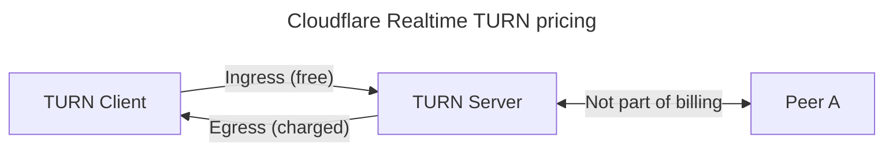

Separately from the SFU, Realtime offers a managed TURN service. TURN acts as a relay point for traffic between WebRTC clients like the browser and SFUs, particularly in scenarios where direct communication is obstructed by NATs or firewalls. TURN maintains an allocation of public IP addresses and ports for each session, ensuring connectivity even in restrictive network environments.

Using Cloudflare Realtime TURN service is available free of charge when used together with the Realtime SFU. Otherwise, it costs $0.05/real-time GB outbound from Cloudflare to the TURN client.

## Service address and ports

| Protocol | Primary address | Primary port | Alternate port |
| - | - | - | - |
| STUN over UDP | stun.cloudflare.com | 3478/udp | 53/udp |
| TURN over UDP | turn.cloudflare.com | 3478/udp | 53 udp |
| TURN over TCP | turn.cloudflare.com | 3478/tcp | 80/tcp |
| TURN over TLS | turn.cloudflare.com | 5349/tcp | 443/tcp |

Note

Use of alternate port 53 only by itself is not recommended. Port 53 is blocked by many ISPs, and by popular browsers such as [Chrome](https://chromium.googlesource.com/chromium/src.git/+/refs/heads/master/net/base/port_util.cc#44) and [Firefox](https://github.com/mozilla/gecko-dev/blob/master/netwerk/base/nsIOService.cpp#L132). It is useful only in certain specific scenerios.

## Regions

Cloudflare Realtime TURN service runs on [Cloudflare's global network](https://www.cloudflare.com/network) - a growing global network of thousands of machines distributed across hundreds of locations, with the notable exception of the Cloudflare's [China Network](https://developers.cloudflare.com/china-network/).

When a client tries to connect to `turn.cloudflare.com`, it *automatically* connects to the Cloudflare location closest to them. We achieve this using [anycast routing](https://www.cloudflare.com/learning/cdn/glossary/anycast-network/).

To learn more about the architecture that makes this possible, read this [technical deep-dive about Realtime](https://blog.cloudflare.com/cloudflare-calls-anycast-webrtc).

## Protocols and Ciphers for TURN over TLS

TLS versions supported include TLS 1.1, TLS 1.2, and TLS 1.3.

| OpenSSL Name | TLS 1.1 | TLS 1.2 | TLS 1.3 |
| - | - | - | - |
| AEAD-AES128-GCM-SHA256 | No | No | ✅ |
| AEAD-AES256-GCM-SHA384 | No | No | ✅ |
| AEAD-CHACHA20-POLY1305-SHA256 | No | No | ✅ |
| ECDHE-ECDSA-AES128-GCM-SHA256 | No | ✅ | No |
| ECDHE-RSA-AES128-GCM-SHA256 | No | ✅ | No |
| ECDHE-RSA-AES128-SHA | ✅ | ✅ | No |
| AES128-GCM-SHA256 | No | ✅ | No |
| AES128-SHA | ✅ | ✅ | No |
| AES256-SHA | ✅ | ✅ | No |

## MTU

There is no specific MTU limit for Cloudflare Realtime TURN service.

## Limits

Cloudflare Realtime TURN service places limits on:

* Unique IP address you can communicate with per relay allocation (>5 new IP/sec)
* Packet rate outbound and inbound to the relay allocation (>5-10 kpps)
* Data rate outbound and inbound to the relay allocation (>50-100 Mbps)

Limits apply to each TURN allocation independently

Each limit is for a single TURN allocation (single TURN user) and not account wide. Same limit will apply to each user regardless of the number of unique TURN users.

These limits are suitable for high-demand applications and also have burst rates higher than those documented above. Hitting these limits will result in packet drops.


-

---
title: What is TURN? · Cloudflare Realtime docs
description: TURN (Traversal Using Relays around NAT) is a protocol that assists
  in traversing Network Address Translators (NATs) or firewalls in order to
  facilitate peer-to-peer communications. It is an extension of the STUN
  (Session Traversal Utilities for NAT) protocol and is defined in RFC 8656.
lastUpdated: 2025-04-08T20:01:03.000Z
chatbotDeprioritize: false
source_url:
  html: https://developers.cloudflare.com/realtime/turn/what-is-turn/
  md: https://developers.cloudflare.com/realtime/turn/what-is-turn/index.md
---

## What is TURN?

TURN (Traversal Using Relays around NAT) is a protocol that assists in traversing Network Address Translators (NATs) or firewalls in order to facilitate peer-to-peer communications. It is an extension of the STUN (Session Traversal Utilities for NAT) protocol and is defined in [RFC 8656](https://datatracker.ietf.org/doc/html/rfc8656).

## How do I use TURN?

Just like you would use a web browser or cURL to use the HTTP protocol, you need to use a tool or a library to use TURN protocol in your application.

Most users of TURN will use it as part of a WebRTC library, such as the one in their browser or part of [Pion](https://github.com/pion/webrtc), [webrtc-rs](https://github.com/webrtc-rs/webrtc) or [libwebrtc](https://webrtc.googlesource.com/src/).

You can use TURN directly in your application too. [Pion](https://github.com/pion/turn) offers a TURN client library in Golang, so does [webrtc-rs](https://github.com/webrtc-rs/webrtc/tree/master/turn) in Rust.

## Key concepts to know when understanding TURN

1. **NAT (Network Address Translation)**: A method used by routers to map multiple private IP addresses to a single public IP address. This is commonly done by home internet routers so multiple computers in the same network can share a single public IP address.

2. **TURN Server**: A relay server that acts as an intermediary for traffic between clients behind NATs. Cloudflare Realtime TURN service is a example of a TURN server.

3. **TURN Client**: An application or device that uses the TURN protocol to communicate through a TURN server. This is your application. It can be a web application using the WebRTC APIs or a native application running on mobile or desktop.

4. **Allocation**: When a TURN server creates an allocation, the TURN server reserves an IP and a port unique to that client.

5. **Relayed Transport Address**: The IP address and port reserved on the TURN server that others on the Internet can use to send data to the TURN client.

## How TURN Works

1. A TURN client sends an Allocate request to a TURN server.
2. The TURN server creates an allocation and returns a relayed transport address to the client.
3. The client can then give this relayed address to its peers.
4. When a peer sends data to the relayed address, the TURN server forwards it to the client.
5. When the client wants to send data to a peer, it sends it through the TURN server, which then forwards it to the peer.

## TURN vs VPN

TURN works similar to a VPN (Virtual Private Network). However TURN servers and VPNs serve different purposes and operate in distinct ways.

A VPN is a general-purpose tool that encrypts all internet traffic from a device, routing it through a VPN server to enhance privacy, security, and anonymity. It operates at the network layer, affects all internet activities, and is often used to bypass geographical restrictions or secure connections on public Wi-Fi.

A TURN server is a specialized tool used by specific applications, particularly for real-time communication. It operates at the application layer, only affecting traffic for applications that use it, and serves as a relay to traverse NATs and firewalls when direct connections between peers are not possible. While a VPN impacts overall internet speed and provides anonymity, a TURN server only affects the performance of specific applications using it.

## Why is TURN Useful?

TURN is often valuable in scenarios where direct peer-to-peer communication is impossible due to NAT or firewall restrictions. Here are some key benefits:

1. **NAT Traversal**: TURN provides a way to establish connections between peers that are both behind NATs, which would otherwise be challenging or impossible.

2. **Firewall Bypassing**: In environments with strict firewall policies, TURN can enable communication that would otherwise be blocked.

3. **Consistent Connectivity**: TURN offers a reliable fallback method when direct or NAT-assisted connections fail.

4. **Privacy**: By relaying traffic through a TURN server, the actual IP addresses of the communicating parties can be hidden from each other.

5. **VoIP and Video Conferencing**: TURN is crucial for applications like Voice over IP (VoIP) and video conferencing, ensuring reliable connections regardless of network configuration.

6. **Online Gaming**: TURN can help online games establish peer-to-peer connections between players behind different types of NATs.

7. **IoT Device Communication**: Internet of Things (IoT) devices can use TURN to communicate when they're behind NATs or firewalls.


-

---
title: Generate Credentials · Cloudflare Realtime docs
description: Cloudflare will issue TURN keys, but these keys cannot be used as
  credentials with turn.cloudflare.com. To use TURN, you need to create
  credentials with a expiring TTL value.
lastUpdated: 2025-12-03T04:47:02.000Z
chatbotDeprioritize: false
source_url:
  html: https://developers.cloudflare.com/realtime/turn/generate-credentials/
  md: https://developers.cloudflare.com/realtime/turn/generate-credentials/index.md
---

Cloudflare will issue TURN keys, but these keys cannot be used as credentials with `turn.cloudflare.com`. To use TURN, you need to create credentials with a expiring TTL value.

## Create a TURN key

To create a TURN credential, you first need to create a TURN key using [Dashboard](https://dash.cloudflare.com/?to=/:account/calls), or the [API](https://developers.cloudflare.com/api/resources/calls/subresources/turn/methods/create/).

You should keep your TURN key on the server side (don't share it with the browser/app). A TURN key is a long-term secret that allows you to generate unlimited, shorter lived TURN credentials for TURN clients.

With a TURN key you can:

* Generate TURN credentials that expire
* Revoke previously issued TURN credentials

## Create credentials

You should generate short-lived credentials for each TURN user. In order to create credentials, you should have a back-end service that uses your TURN Token ID and API token to generate credentials. It will make an API call like this:

```bash
curl https://rtc.live.cloudflare.com/v1/turn/keys/$TURN_KEY_ID/credentials/generate-ice-servers \
--header "Authorization: Bearer $TURN_KEY_API_TOKEN" \
--header "Content-Type: application/json" \
--data '{"ttl": 86400}'
```

The JSON response below can then be passed on to your front-end application:

```json
{
  "iceServers": [
    {
      "urls": [
        "stun:stun.cloudflare.com:3478",
        "stun:stun.cloudflare.com:53"
      ]
    },
    {
      "urls": [
        "turn:turn.cloudflare.com:3478?transport=udp",
        "turn:turn.cloudflare.com:53?transport=udp",
        "turn:turn.cloudflare.com:3478?transport=tcp",
        "turn:turn.cloudflare.com:80?transport=tcp",
        "turns:turn.cloudflare.com:5349?transport=tcp",
        "turns:turn.cloudflare.com:443?transport=tcp"
      ],
      "username": "bc91b63e2b5d759f8eb9f3b58062439e0a0e15893d76317d833265ad08d6631099ce7c7087caabb31ad3e1c386424e3e",
      "credential": "ebd71f1d3edbc2b0edae3cd5a6d82284aeb5c3b8fdaa9b8e3bf9cec683e0d45fe9f5b44e5145db3300f06c250a15b4a0"
    }
  ]
}
```

Note

The list of returned URLs contains URLs with the primary and alternate ports. The alternate port 53 is known to be blocked by web browsers, and the TURN URL will time out if used in browsers. If you are using trickle ICE, this will not cause issues. Without trickle ICE you might want to filter out the URL with port 53 to avoid waiting for a timeout.

Use `iceServers` as follows when instantiating the `RTCPeerConnection`:

```js
const myPeerConnection = new RTCPeerConnection({
  iceServers: [
    {
      urls: [
        "stun:stun.cloudflare.com:3478",
        "stun:stun.cloudflare.com:53"
      ]
    },
    {
      urls: [
        "turn:turn.cloudflare.com:3478?transport=udp",
        "turn:turn.cloudflare.com:53?transport=udp",
        "turn:turn.cloudflare.com:3478?transport=tcp",
        "turn:turn.cloudflare.com:80?transport=tcp",
        "turns:turn.cloudflare.com:5349?transport=tcp",
        "turns:turn.cloudflare.com:443?transport=tcp"
      ],
      "username": "bc91b63e2b5d759f8eb9f3b58062439e0a0e15893d76317d833265ad08d6631099ce7c7087caabb31ad3e1c386424e3e",
      "credential": "ebd71f1d3edbc2b0edae3cd5a6d82284aeb5c3b8fdaa9b8e3bf9cec683e0d45fe9f5b44e5145db3300f06c250a15b4a0"
    },
  ],
});
```

The `ttl` value can be adjusted to expire the short lived key in a certain amount of time. This value should be larger than the time you'd expect the users to use the TURN service. For example, if you're using TURN for a video conferencing app, the value should be set to the longest video call you'd expect to happen in the app.

When using short-lived TURN credentials with WebRTC, credentials can be refreshed during a WebRTC session using the `RTCPeerConnection` [`setConfiguration()`](https://developer.mozilla.org/en-US/docs/Web/API/RTCPeerConnection/setConfiguration) API.

## Revoke credentials

Short lived credentials can also be revoked before their TTL expires with a API call like this:

```bash
curl --request POST \
https://rtc.live.cloudflare.com/v1/turn/keys/$TURN_KEY_ID/credentials/$USERNAME/revoke \
--header "Authorization: Bearer $TURN_KEY_API_TOKEN"
```


-

curl https://rtc.live.cloudflare.com/v1/turn/keys/$TURN_KEY_ID/credentials/generate-ice-servers \
--header "Authorization: Bearer $TURN_KEY_API_TOKEN" \
--header "Content-Type: application/json" \
--data '{"ttl": 86400}'

--

{
  "iceServers": [
    {
      "urls": [
        "stun:stun.cloudflare.com:3478",
        "stun:stun.cloudflare.com:53"
      ]
    },
    {
      "urls": [
        "turn:turn.cloudflare.com:3478?transport=udp",
        "turn:turn.cloudflare.com:53?transport=udp",
        "turn:turn.cloudflare.com:3478?transport=tcp",
        "turn:turn.cloudflare.com:80?transport=tcp",
        "turns:turn.cloudflare.com:5349?transport=tcp",
        "turns:turn.cloudflare.com:443?transport=tcp"
      ],
      "username": "bc91b63e2b5d759f8eb9f3b58062439e0a0e15893d76317d833265ad08d6631099ce7c7087caabb31ad3e1c386424e3e",
      "credential": "ebd71f1d3edbc2b0edae3cd5a6d82284aeb5c3b8fdaa9b8e3bf9cec683e0d45fe9f5b44e5145db3300f06c250a15b4a0"
    }
  ]
}

-

const myPeerConnection = new RTCPeerConnection({
  iceServers: [
    {
      urls: [
        "stun:stun.cloudflare.com:3478",
        "stun:stun.cloudflare.com:53"
      ]
    },
    {
      urls: [
        "turn:turn.cloudflare.com:3478?transport=udp",
        "turn:turn.cloudflare.com:53?transport=udp",
        "turn:turn.cloudflare.com:3478?transport=tcp",
        "turn:turn.cloudflare.com:80?transport=tcp",
        "turns:turn.cloudflare.com:5349?transport=tcp",
        "turns:turn.cloudflare.com:443?transport=tcp"
      ],
      "username": "bc91b63e2b5d759f8eb9f3b58062439e0a0e15893d76317d833265ad08d6631099ce7c7087caabb31ad3e1c386424e3e",
      "credential": "ebd71f1d3edbc2b0edae3cd5a6d82284aeb5c3b8fdaa9b8e3bf9cec683e0d45fe9f5b44e5145db3300f06c250a15b4a0"
    },
  ],
});

--

curl --request POST \
https://rtc.live.cloudflare.com/v1/turn/keys/$TURN_KEY_ID/credentials/$USERNAME/revoke \
--header "Authorization: Bearer $TURN_KEY_API_TOKEN"

-

---
title: Custom TURN domains · Cloudflare Realtime docs
description: Cloudflare Realtime TURN service supports using custom domains for
  UDP, and TCP - but not TLS protocols. Custom domains do not affect any of the
  performance of Cloudflare Realtime TURN and is set up via a simple CNAME DNS
  record on your domain.
lastUpdated: 2025-04-08T20:01:03.000Z
chatbotDeprioritize: false
source_url:
  html: https://developers.cloudflare.com/realtime/turn/custom-domains/
  md: https://developers.cloudflare.com/realtime/turn/custom-domains/index.md
---

Cloudflare Realtime TURN service supports using custom domains for UDP, and TCP - but not TLS protocols. Custom domains do not affect any of the performance of Cloudflare Realtime TURN and is set up via a simple CNAME DNS record on your domain.

| Protocol | Custom domains | Primary port | Alternate port |
| - | - | - | - |
| STUN over UDP | ✅ | 3478/udp | 53/udp |
| TURN over UDP | ✅ | 3478/udp | 53 udp |
| TURN over TCP | ✅ | 3478/tcp | 80/tcp |
| TURN over TLS | No | 5349/tcp | 443/tcp |

## Setting up a CNAME record

To use custom domains for TURN, you must create a CNAME DNS record pointing to `turn.cloudflare.com`.

Warning

Do not resolve the address of `turn.cloudflare.com` or `stun.cloudflare.com` or use an IP address as the value you input to your DNS record. Only CNAME records are supported.

Any DNS provider, including Cloudflare DNS can be used to set up a CNAME for custom domains.

Note

If Cloudflare's authoritative DNS service is used, the record must be set to [DNS-only or "grey cloud" mode](https://developers.cloudflare.com/dns/proxy-status/#dns-only-records).\`

There is no additional charge to using a custom hostname with Cloudflare Realtime TURN.


-
---
title: Replacing existing TURN servers · Cloudflare Realtime docs
description: If you are a existing TURN provider but would like to switch to
  providing Cloudflare Realtime TURN for your customers, there is a few
  considerations.
lastUpdated: 2025-04-08T20:01:03.000Z
chatbotDeprioritize: false
source_url:
  html: https://developers.cloudflare.com/realtime/turn/replacing-existing/
  md: https://developers.cloudflare.com/realtime/turn/replacing-existing/index.md
---

If you are a existing TURN provider but would like to switch to providing Cloudflare Realtime TURN for your customers, there is a few considerations.

## Benefits

Cloudflare Realtime TURN service can reduce tangible and untangible costs associated with TURN servers:

* Server costs (AWS EC2 etc)
* Bandwidth costs (Egress, load balancing etc)
* Time and effort to set up a TURN process and maintenance of server
* Scaling the servers up and down
* Maintain the TURN server with security and feature updates
* Maintain high availability

## Recommendations

### Separate environments with TURN keys

When using Cloudflare Realtime TURN service at scale, consider separating environments such as "testing", "staging" or "production" with TURN keys. You can create up to 1,000 TURN keys in your account, which can be used to generate end user credentials.

There is no limit to how many end-user credentials you can create with a particular TURN key.

### Tag users with custom identifiers

Cloudflare Realtime TURN service lets you tag each credential with a custom identifier as you generate a credential like below:

```bash
curl https://rtc.live.cloudflare.com/v1/turn/keys/$TURN_KEY_ID/credentials/generate \
--header "Authorization: Bearer $TURN_KEY_API_TOKEN" \
--header "Content-Type: application/json" \
--data '{"ttl": 864000, "customIdentifier": "user4523958"}'
```

Use this field to aggregate usage for a specific user or group of users and collect analytics.

### Monitor usage

You can monitor account wide usage with the [GraphQL analytics API](https://developers.cloudflare.com/realtime/turn/analytics/). This is useful for keeping track of overall usage for billing purposes, watching for unexpected changes. You can get timeseries data from TURN analytics with various filters in place.

### Monitor for credential abuse

If you share TURN credentials with end users, credential abuse is possible. You can monitor for abuse by tagging each credential with custom identifiers and monitoring for top custom identifiers in your application via the [GraphQL analytics API](https://developers.cloudflare.com/realtime/turn/analytics/).

## How to bill end users for their TURN usage

When billing for TURN usage in your application, it's crucial to understand and account for adaptive sampling in TURN analytics. This system employs adaptive sampling to efficiently handle large datasets while maintaining accuracy.

The sampling process in TURN analytics works on two levels:

* At data collection: Usage data points may be sampled if they are generated too quickly.
* At query time: Additional sampling may occur if the query is too complex or covers a large time range.

To ensure accurate billing, write a single query that sums TURN usage per customer per time period, returning a single value. Avoid using queries that list usage for multiple customers simultaneously.

By following these guidelines and understanding how TURN analytics handles sampling, you can ensure more accurate billing for your end users based on their TURN usage.

Note

Cloudflare Realtime only bills for traffic from Cloudflare's servers to your client, called `egressBytes`.

### Example queries

Incorrect approach example

Querying TURN usage for multiple customers in a single query can lead to inaccurate results. This is because the usage pattern of one customer could affect the sampling rate applied to another customer's data, potentially skewing the results.

```plaintext
query{
  viewer {
    usage: accounts(filter: { accountTag: "8846293bd06d1af8c106d89ec1454fe6" }) {
        callsTurnUsageAdaptiveGroups(
          filter: {
          datetimeMinute_gt: "2024-07-15T02:07:07Z"
          datetimeMinute_lt: "2024-08-10T02:07:05Z"
        }
          limit: 100
          orderBy: [customIdentifier_ASC]
        ) {
          dimensions {
            customIdentifier
          }
          sum {
            egressBytes
          }
        }
      }
    }
  }
```

Below is a query that queries usage only for a single customer.

```plaintext
query{
  viewer {
    usage: accounts(filter: { accountTag: "8846293bd06d1af8c106d89ec1454fe6" }) {
        callsTurnUsageAdaptiveGroups(
          filter: {
          datetimeMinute_gt: "2024-07-15T02:07:07Z"
          datetimeMinute_lt: "2024-08-10T02:07:05Z"
          customIdentifier: "myCustomer1111"
        }
          limit: 1
          orderBy: [customIdentifier_ASC]
        ) {
          dimensions {
            customIdentifier
          }
          sum {
            egressBytes
          }
        }
      }
    }
  }
```


-


curl https://rtc.live.cloudflare.com/v1/turn/keys/$TURN_KEY_ID/credentials/generate \
--header "Authorization: Bearer $TURN_KEY_API_TOKEN" \
--header "Content-Type: application/json" \
--data '{"ttl": 864000, "customIdentifier": "user4523958"}'

-


query{
  viewer {
    usage: accounts(filter: { accountTag: "8846293bd06d1af8c106d89ec1454fe6" }) {
        callsTurnUsageAdaptiveGroups(
          filter: {
          datetimeMinute_gt: "2024-07-15T02:07:07Z"
          datetimeMinute_lt: "2024-08-10T02:07:05Z"
        }
          limit: 100
          orderBy: [customIdentifier_ASC]
        ) {
          dimensions {
            customIdentifier
          }
          sum {
            egressBytes
          }
        }
      }
    }
  }

-


query{
  viewer {
    usage: accounts(filter: { accountTag: "8846293bd06d1af8c106d89ec1454fe6" }) {
        callsTurnUsageAdaptiveGroups(
          filter: {
          datetimeMinute_gt: "2024-07-15T02:07:07Z"
          datetimeMinute_lt: "2024-08-10T02:07:05Z"
          customIdentifier: "myCustomer1111"
        }
          limit: 1
          orderBy: [customIdentifier_ASC]
        ) {
          dimensions {
            customIdentifier
          }
          sum {
            egressBytes
          }
        }
      }
    }
  }

-


---
title: TURN Feature Matrix · Cloudflare Realtime docs
lastUpdated: 2025-12-05T18:35:45.000Z
chatbotDeprioritize: false
source_url:
  html: https://developers.cloudflare.com/realtime/turn/rfc-matrix/
  md: https://developers.cloudflare.com/realtime/turn/rfc-matrix/index.md
---

## TURN client to TURN server protocols

| Protocol | Support | Relevant specification |
| - | - | - |
| UDP | ✅ | [RFC 5766](https://datatracker.ietf.org/doc/html/rfc5766) |
| TCP | ✅ | [RFC 5766](https://datatracker.ietf.org/doc/html/rfc5766) |
| TLS | ✅ | [RFC 5766](https://datatracker.ietf.org/doc/html/rfc5766) |
| DTLS | No | [draft-petithuguenin-tram-turn-dtls-00](http://tools.ietf.org/html/draft-petithuguenin-tram-turn-dtls-00) |

## TURN client to TURN server protocols

| Protocol | Support | Relevant specification |
| - | - | - |
| TURN (base RFC) | ✅ | [RFC 5766](https://datatracker.ietf.org/doc/html/rfc5766) |
| TURN REST API | ✅ (See [FAQ](https://developers.cloudflare.com/realtime/turn/faq/#does-cloudflare-realtime-turn-support-the-expired-ietf-rfc-draft-draft-uberti-behave-turn-rest-00)) | [draft-uberti-behave-turn-rest-00](http://tools.ietf.org/html/draft-uberti-behave-turn-rest-00) |
| Origin field in TURN (Multi-tenant TURN Server) | ✅ | [draft-ietf-tram-stun-origin-06](https://tools.ietf.org/html/draft-ietf-tram-stun-origin-06) |
| ALPN support for STUN & TURN | ✅ | [RFC 7443](https://datatracker.ietf.org/doc/html/rfc7443) |
| TURN Bandwidth draft specs | No | [draft-thomson-tram-turn-bandwidth-01](http://tools.ietf.org/html/draft-thomson-tram-turn-bandwidth-01) |
| TURN-bis (with dual allocation) draft specs | No | [draft-ietf-tram-turnbis-04](http://tools.ietf.org/html/draft-ietf-tram-turnbis-04) |
| TCP relaying TURN extension | No | [RFC 6062](https://datatracker.ietf.org/doc/html/rfc6062) |
| IPv6 extension for TURN | No | [RFC 6156](https://datatracker.ietf.org/doc/html/rfc6156) |
| oAuth third-party TURN/STUN authorization | No | [RFC 7635](https://datatracker.ietf.org/doc/html/rfc7635) |
| DTLS support (for TURN) | No | [draft-petithuguenin-tram-stun-dtls-00](https://datatracker.ietf.org/doc/html/draft-petithuguenin-tram-stun-dtls-00) |
| Mobile ICE (MICE) support | No | [draft-wing-tram-turn-mobility-02](http://tools.ietf.org/html/draft-wing-tram-turn-mobility-02) |


-

---
title: Analytics · Cloudflare Realtime docs
description: Cloudflare Realtime TURN service counts ingress and egress usage in
  bytes. You can access this real-time and historical data using the TURN
  analytics API. You can see TURN usage data in a time series or aggregate that
  shows traffic in bytes over time.
lastUpdated: 2025-12-05T17:40:43.000Z
chatbotDeprioritize: false
source_url:
  html: https://developers.cloudflare.com/realtime/turn/analytics/
  md: https://developers.cloudflare.com/realtime/turn/analytics/index.md
---

Cloudflare Realtime TURN service counts ingress and egress usage in bytes. You can access this real-time and historical data using the TURN analytics API. You can see TURN usage data in a time series or aggregate that shows traffic in bytes over time.

Cloudflare TURN analytics is available over the GraphQL API only.

API token permissions

You will need the "Account Analytics" permission on your API token to make queries to the Realtime GraphQL API.

Note

See [GraphQL API](https://developers.cloudflare.com/analytics/graphql-api/) for more information on how to set up your GraphQL client. The examples below use the same GraphQL endpoint at `https://api.cloudflare.com/client/v4/graphql`.

## Available metrics and dimensions

TURN analytics provides rich data that you can query and aggregate in various ways.

### Metrics

You can query the following metrics:

* **egressBytes**: Total bytes sent from TURN servers to clients
* **ingressBytes**: Total bytes received by TURN servers from clients
* **concurrentConnections**: Average number of concurrent connections

These metrics support aggregations using `sum` and `avg` functions.

### Dimensions

You can break down your data by the following dimensions:

* **Time aggregations**: `datetime`, `datetimeMinute`, `datetimeFiveMinutes`, `datetimeFifteenMinutes`, `datetimeHour`
* **Geographic**: `datacenterCity`, `datacenterCountry`, `datacenterRegion` (Cloudflare data center location)
* **Identity**: `keyId`, `customIdentifier`, `username`

### Filters

You can filter the data in TURN analytics on:

* Datetime range
* TURN Key ID
* TURN Username
* Custom identifier

Note

[Custom identifiers](https://developers.cloudflare.com/realtime/turn/replacing-existing/#tag-users-with-custom-identifiers) are useful for accounting usage for different users in your system.

## GraphQL clients

GraphQL is a self-documenting protocol. You can use any GraphQL client to explore the schema and available fields. Popular options include:

* **[Altair](https://altairgraphql.dev/)**: A feature-rich GraphQL client with schema documentation explorer
* **[GraphiQL](https://github.com/graphql/graphiql)**: The original GraphQL IDE
* **[Postman](https://www.postman.com/)**: Supports GraphQL queries with schema introspection

To explore the full schema, configure your client to connect to `https://api.cloudflare.com/client/v4/graphql` with your API credentials. Refer to [Explore the GraphQL schema](https://developers.cloudflare.com/analytics/graphql-api/getting-started/explore-graphql-schema/) for detailed instructions.

## Useful TURN analytics queries

Below are some example queries for common usecases. You can modify them to adapt your use case and get different views to the analytics data.

### Concurrent connections with data usage over time

This comprehensive query shows how to retrieve multiple metrics simultaneously, including concurrent connections, egress, and ingress bytes in 5-minute intervals. This is useful for building dashboards and monitoring real-time usage.

```graphql
query concurrentConnections {
  viewer {
    accounts(filter: { accountTag: $accountId }) {
      callsTurnUsageAdaptiveGroups(
        limit: 10000
        filter: { date_geq: $dateFrom, date_leq: $dateTo }
      ) {
        dimensions {
          datetimeFiveMinutes
        }
        avg {
          concurrentConnectionsFiveMinutes
        }
        sum {
          egressBytes
          ingressBytes
        }
      }
    }
  }
}
```

Example response:

```json
{
  "data": {
    "viewer": {
      "accounts": [
        {
          "callsTurnUsageAdaptiveGroups": [
            {
              "avg": {
                "concurrentConnectionsFiveMinutes": 816
              },
              "dimensions": {
                "datetimeFiveMinutes": "2025-12-02T03:45:00Z"
              },
              "sum": {
                "egressBytes": 207314144,
                "ingressBytes": 8534200
              }
            },
            {
              "avg": {
                "concurrentConnectionsFiveMinutes": 1945
              },
              "dimensions": {
                "datetimeFiveMinutes": "2025-12-02T16:00:00Z"
              },
              "sum": {
                "egressBytes": 462909020,
                "ingressBytes": 128434592
              }
            },


          ]
        }
      ]
    }
  ]
}
```

### Top TURN keys by egress

```plaintext
query egressByTurnKey{
  viewer {
    usage: accounts(filter: { accountTag: $accountId }) {
        callsTurnUsageAdaptiveGroups(
          filter: {
          date_geq: $dateFrom,
          date_leq: $dateTo
        }
          limit: 2
          orderBy: [sum_egressBytes_DESC]
        ) {
          dimensions {
            keyId
          }
          sum {
            egressBytes
          }
        }
      }
    },
    "errors": null
  }
```

Example response:

```plaintext
{
  "data": {
    "viewer": {
      "usage": [
        {
          "callsTurnUsageAdaptiveGroups": [
            {
              "dimensions": {
                "keyId": "82a58d0aeabfa8f4a4e0c4a9efc9cda5"
              },
              "sum": {
                "egressBytes": 160040068147
              }
            }
          ]
        }
      ]
    }
  },
  "errors": null
}
```

### Top TURN custom identifiers

```graphql
query topTurnCustomIdentifiers {
  viewer {
    accounts(filter: { accountTag: $accountId }) {
      callsTurnUsageAdaptiveGroups(
        filter: { date_geq: $dateFrom, date_leq: $dateTo }
        limit: 1
        orderBy: [sum_egressBytes_DESC]
      ) {
        dimensions {
          customIdentifier
        }
        sum {
          egressBytes
        }
      }
    }
  }
}
```

Example response:

```plaintext
{
  "data": {
    "viewer": {
      "accounts": [
        {
          "callsTurnUsageAdaptiveGroups": [
            {
              "dimensions": {
                "customIdentifier": "some identifier"
              },
              "sum": {
                "egressBytes": 160040068147
              }
            }
          ]
        }
      ]
    }
  },
  "errors": null
}
```

### Usage for a specific custom identifier

```graphql
query {
  viewer {
    accounts(filter: { accountTag: $accountId }) {
      callsTurnUsageAdaptiveGroups(
        filter: {
          date_geq: $dateFrom
          date_leq: $dateTo
          customIdentifier: "tango"
        }
        limit: 100
        orderBy: []
      ) {
        dimensions {
          keyId
          customIdentifier
        }
        sum {
          egressBytes
        }
      }
    }
  }
}
```

Example response:

```plaintext
{
  "data": {
    "viewer": {
      "usage": [
        {
          "callsTurnUsageAdaptiveGroups": [
            {
              "dimensions": {
                "customIdentifier": "tango",
                "keyId": "74007022d80d7ebac4815fb776b9d3ed"
              },
              "sum": {
                "egressBytes": 162641324
              }
            }
          ]
        }
      ]
    }
  },
  "errors": null
}
```

### Usage as a timeseries (for graphs)

```graphql
query {
  viewer {
    accounts(filter: { accountTag: $accountId }) {
      callsTurnUsageAdaptiveGroups(
        filter: { date_geq: $dateFrom, date_leq: $dateTo }
        limit: 100
        orderBy: [datetimeMinute_ASC]
      ) {
        dimensions {
          datetimeMinute
        }
        sum {
          egressBytes
        }
      }
    }
  }
}
```

Example response:

```plaintext
{
  "data": {
    "viewer": {
      "accounts": [
        {
          "callsTurnUsageAdaptiveGroups": [
            {
              "dimensions": {
                "datetimeMinute": "2025-12-01T00:00:00Z"
              },
              "sum": {
                "egressBytes": 159512
              }
            },
            {
              "dimensions": {
                "datetimeMinute": "2025-12-01T00:01:00Z"
              },
              "sum": {
                "egressBytes": 133818
              }
            },
            ... (more data here)
           ]
        }
      ]
    }
  },
  "errors": null
}
```

### Usage breakdown by geographic location

You can break down usage data by Cloudflare data center location to understand where your TURN traffic is being served. This is useful for optimizing regional capacity and understanding geographic distribution of your users.

```graphql
query {
  viewer {
    accounts(filter: { accountTag: $accountId }) {
      callsTurnUsageAdaptiveGroups(
        limit: 100
        filter: { date_geq: $dateFrom, date_leq: $dateTo }
        orderBy: [sum_egressBytes_DESC]
      ) {
        dimensions {
          datacenterCity
          datacenterCode
          datacenterRegion
          datacenterCountry
        }
        sum {
          egressBytes
          ingressBytes
        }
        avg {
          concurrentConnectionsFiveMinutes
        }
      }
    }
  }
}
```

Example response:

```json
{
  "data": {
    "viewer": {
      "accounts": [
        {
          "callsTurnUsageAdaptiveGroups": [
            {
              "avg": {
                "concurrentConnectionsFiveMinutes": 3135
              },
              "dimensions": {
                "datacenterCity": "Columbus",
                "datacenterCode": "CMH",
                "datacenterCountry": "US",
                "datacenterRegion": "ENAM"
              },
              "sum": {
                "egressBytes": 47720931316,
                "ingressBytes": 19351966366
              }
            },
            ...
          ]
        }
      ]
    }
  },
  "errors": null
}
```

### Filter by specific key or identifier

You can filter data to analyze a specific TURN key or custom identifier. This is useful for debugging specific connections or analyzing usage patterns for particular clients.

```graphql
query {
  viewer {
    accounts(filter: { accountTag: $accountId }) {
      callsTurnUsageAdaptiveGroups(
        limit: 1000
        filter: {
          keyId: "82a58d0aeabfa8f4a4e0c4a9efc9cda5"
          date_geq: $dateFrom
          date_leq: $dateTo
        }
        orderBy: [datetimeFiveMinutes_ASC]
      ) {
        dimensions {
          datetimeFiveMinutes
          keyId
        }
        sum {
          egressBytes
          ingressBytes
        }
        avg {
          concurrentConnectionsFiveMinutes
        }
      }
    }
  }
}
```

Example response:

```json
{
  "data": {
    "viewer": {
      "accounts": [
        {
          "callsTurnUsageAdaptiveGroups": [
            {
              "avg": {
                "concurrentConnectionsFiveMinutes": 130
              },
              "dimensions": {
                "datetimeFiveMinutes": "2025-12-01T00:00:00Z",
                "keyId": "82a58d0aeabfa8f4a4e0c4a9efc9cda5"
              },
              "sum": {
                "egressBytes": 609156,
                "ingressBytes": 464326
              }
            },
            {
              "avg": {
                "concurrentConnectionsFiveMinutes": 118
              },
              "dimensions": {
                "datetimeFiveMinutes": "2025-12-01T00:05:00Z",
                "keyId": "82a58d0aeabfa8f4a4e0c4a9efc9cda5"
              },
              "sum": {
                "egressBytes": 534948,
                "ingressBytes": 401286
              }
            },
            ...
          ]
        }
      ]
    }
  },
  "errors": null
}
```

### Time aggregation options

You can choose different time aggregation intervals depending on your analysis needs:

* **`datetimeMinute`**: 1-minute intervals (most granular)
* **`datetimeFiveMinutes`**: 5-minute intervals (recommended for dashboards)
* **`datetimeFifteenMinutes`**: 15-minute intervals
* **`datetimeHour`**: Hourly intervals (best for long-term trends)

Example query with hourly aggregation:

```graphql
query {
  viewer {
    accounts(filter: { accountTag: $accountId }) {
      callsTurnUsageAdaptiveGroups(
        limit: 1000
        filter: {
          keyId: "82a58d0aeabfa8f4a4e0c4a9efc9cda5"
          date_geq: $dateFrom
          date_leq: $dateTo
        }
        orderBy: [datetimeFiveMinutes_ASC]
      ) {
        dimensions {
          datetimeFiveMinutes
          keyId
        }
        sum {
          egressBytes
          ingressBytes
        }
        avg {
          concurrentConnectionsFiveMinutes
        }
      }
    }
  }
}
```

Example response:

```json
{
  "data": {
    "viewer": {
      "accounts": [
        {
          "callsTurnUsageAdaptiveGroups": [
            {
              "avg": {
                "concurrentConnectionsFiveMinutes": 130
              },
              "dimensions": {
                "datetimeFiveMinutes": "2025-12-01T00:00:00Z",
                "keyId": "82a58d0aeabfa8f4a4e0c4a9efc9cda5"
              },
              "sum": {
                "egressBytes": 609156,
                "ingressBytes": 464326
              }
            },
            {
              "avg": {
                "concurrentConnectionsFiveMinutes": 118
              },
              "dimensions": {
                "datetimeFiveMinutes": "2025-12-01T00:05:00Z",
                "keyId": "82a58d0aeabfa8f4a4e0c4a9efc9cda5"
              },
              "sum": {
                "egressBytes": 534948,
                "ingressBytes": 401286
              }
            },
            ...
          ]
        }
      ]
    }
  },
  "errors": null
}
```

## Advanced use cases

### Combining multiple dimensions

You can combine multiple dimensions in a single query to get more detailed breakdowns. For example, to see usage by both time and location:

```graphql
query {
  viewer {
    accounts(filter: { accountTag: $accountId }) {
      callsTurnUsageAdaptiveGroups(
        limit: 10000
        filter: { date_geq: $dateFrom, date_leq: $dateTo }
        orderBy: [datetimeHour_ASC, sum_egressBytes_DESC]
      ) {
        dimensions {
          datetimeHour
          datacenterCity
          datacenterCountry
        }
        sum {
          egressBytes
          ingressBytes
        }
      }
    }
  }
}
```

Example response:

```json
{
  "data": {
    "viewer": {
      "accounts": [
        {
          "callsTurnUsageAdaptiveGroups": [
            {
              "dimensions": {
                "datacenterCity": "Chennai",
                "datacenterCountry": "IN",
                "datetimeHour": "2025-12-01T00:00:00Z"
              },
              "sum": {
                "egressBytes": 3416216,
                "ingressBytes": 498927214
              }
            },
            {
              "dimensions": {
                "datacenterCity": "Mumbai",
                "datacenterCountry": "IN",
                "datetimeHour": "2025-12-01T00:00:00Z"
              },
              "sum": {
                "egressBytes": 1267076,
                "ingressBytes": 1140140
              }
            },
            ...
          ]
        }
      ]
    }
  },
  "errors": null
}
```

### Identifying top consumers

To find which keys or custom identifiers are using the most bandwidth:

```graphql
query {
  viewer {
    accounts(filter: { accountTag: $accountId }) {
      callsTurnUsageAdaptiveGroups(
        limit: 10
        filter: { date_geq: $dateFrom, date_leq: $dateTo }
        orderBy: [sum_egressBytes_DESC, sum_ingressBytes_DESC]
      ) {
        dimensions {
          keyId
          customIdentifier
        }
        sum {
          egressBytes
          ingressBytes
        }
        avg {
          concurrentConnectionsFiveMinutes
        }
      }
    }
  }
}
```

Example response:

```json
{
  "data": {
    "viewer": {
      "accounts": [
        {
          "callsTurnUsageAdaptiveGroups": [
            {
              "avg": {
                "concurrentConnectionsFiveMinutes": 837305
              },
              "dimensions": {
                "customIdentifier": "",
                "keyId": "82a58d0aeabfa8f4a4e0c4a9efc9cda5"
              },
              "sum": {
                "egressBytes": 160040068147,
                "ingressBytes": 154955460564
              }
            }
          ]
        }
      ]
    }
  },
  "errors": null
}
```

## Schema exploration

The GraphQL Analytics API is self-documenting. You can use introspection to discover all available fields, filters, and capabilities for `callsTurnUsageAdaptiveGroups`. Using a GraphQL client like Altair or GraphiQL, you can browse the schema interactively to find additional dimensions and metrics that may be useful for your specific use case.

For more information on GraphQL introspection and schema exploration, refer to:

* [Explore the GraphQL schema](https://developers.cloudflare.com/analytics/graphql-api/getting-started/explore-graphql-schema/)
* [GraphQL introspection](https://developers.cloudflare.com/analytics/graphql-api/features/discovery/introspection/)


-

query concurrentConnections {
  viewer {
    accounts(filter: { accountTag: $accountId }) {
      callsTurnUsageAdaptiveGroups(
        limit: 10000
        filter: { date_geq: $dateFrom, date_leq: $dateTo }
      ) {
        dimensions {
          datetimeFiveMinutes
        }
        avg {
          concurrentConnectionsFiveMinutes
        }
        sum {
          egressBytes
          ingressBytes
        }
      }
    }
  }
}

-


{
  "data": {
    "viewer": {
      "accounts": [
        {
          "callsTurnUsageAdaptiveGroups": [
            {
              "avg": {
                "concurrentConnectionsFiveMinutes": 816
              },
              "dimensions": {
                "datetimeFiveMinutes": "2025-12-02T03:45:00Z"
              },
              "sum": {
                "egressBytes": 207314144,
                "ingressBytes": 8534200
              }
            },
            {
              "avg": {
                "concurrentConnectionsFiveMinutes": 1945
              },
              "dimensions": {
                "datetimeFiveMinutes": "2025-12-02T16:00:00Z"
              },
              "sum": {
                "egressBytes": 462909020,
                "ingressBytes": 128434592
              }
            },

          ]
        }
      ]
    }
  ]
}

-

query egressByTurnKey{
  viewer {
    usage: accounts(filter: { accountTag: $accountId }) {
        callsTurnUsageAdaptiveGroups(
          filter: {
          date_geq: $dateFrom,
          date_leq: $dateTo
        }
          limit: 2
          orderBy: [sum_egressBytes_DESC]
        ) {
          dimensions {
            keyId
          }
          sum {
            egressBytes
          }
        }
      }
    },
    "errors": null
  }

-


query {
  viewer {
    accounts(filter: { accountTag: $accountId }) {
      callsTurnUsageAdaptiveGroups(
        filter: {
          date_geq: $dateFrom
          date_leq: $dateTo
          customIdentifier: "tango"
        }
        limit: 100
        orderBy: []
      ) {
        dimensions {
          keyId
          customIdentifier
        }
        sum {
          egressBytes
        }
      }
    }
  }
}

-

{
  "data": {
    "viewer": {
      "usage": [
        {
          "callsTurnUsageAdaptiveGroups": [
            {
              "dimensions": {
                "customIdentifier": "tango",
                "keyId": "74007022d80d7ebac4815fb776b9d3ed"
              },
              "sum": {
                "egressBytes": 162641324
              }
            }
          ]
        }
      ]
    }
  },
  "errors": null
}

-

query {
  viewer {
    accounts(filter: { accountTag: $accountId }) {
      callsTurnUsageAdaptiveGroups(
        filter: { date_geq: $dateFrom, date_leq: $dateTo }
        limit: 100
        orderBy: [datetimeMinute_ASC]
      ) {
        dimensions {
          datetimeMinute
        }
        sum {
          egressBytes
        }
      }
    }
  }
}

-

query {
  viewer {
    accounts(filter: { accountTag: $accountId }) {
      callsTurnUsageAdaptiveGroups(
        limit: 100
        filter: { date_geq: $dateFrom, date_leq: $dateTo }
        orderBy: [sum_egressBytes_DESC]
      ) {
        dimensions {
          datacenterCity
          datacenterCode
          datacenterRegion
          datacenterCountry
        }
        sum {
          egressBytes
          ingressBytes
        }
        avg {
          concurrentConnectionsFiveMinutes
        }
      }
    }
  }
}

-

query {
  viewer {
    accounts(filter: { accountTag: $accountId }) {
      callsTurnUsageAdaptiveGroups(
        limit: 1000
        filter: {
          keyId: "82a58d0aeabfa8f4a4e0c4a9efc9cda5"
          date_geq: $dateFrom
          date_leq: $dateTo
        }
        orderBy: [datetimeFiveMinutes_ASC]
      ) {
        dimensions {
          datetimeFiveMinutes
          keyId
        }
        sum {
          egressBytes
          ingressBytes
        }
        avg {
          concurrentConnectionsFiveMinutes
        }
      }
    }
  }
}

-

query {
  viewer {
    accounts(filter: { accountTag: $accountId }) {
      callsTurnUsageAdaptiveGroups(
        limit: 1000
        filter: {
          keyId: "82a58d0aeabfa8f4a4e0c4a9efc9cda5"
          date_geq: $dateFrom
          date_leq: $dateTo
        }
        orderBy: [datetimeFiveMinutes_ASC]
      ) {
        dimensions {
          datetimeFiveMinutes
          keyId
        }
        sum {
          egressBytes
          ingressBytes
        }
        avg {
          concurrentConnectionsFiveMinutes
        }
      }
    }
  }
}

-


query {
  viewer {
    accounts(filter: { accountTag: $accountId }) {
      callsTurnUsageAdaptiveGroups(
        limit: 10000
        filter: { date_geq: $dateFrom, date_leq: $dateTo }
        orderBy: [datetimeHour_ASC, sum_egressBytes_DESC]
      ) {
        dimensions {
          datetimeHour
          datacenterCity
          datacenterCountry
        }
        sum {
          egressBytes
          ingressBytes
        }
      }
    }
  }
}


--

query {
  viewer {
    accounts(filter: { accountTag: $accountId }) {
      callsTurnUsageAdaptiveGroups(
        limit: 10000
        filter: { date_geq: $dateFrom, date_leq: $dateTo }
        orderBy: [datetimeHour_ASC, sum_egressBytes_DESC]
      ) {
        dimensions {
          datetimeHour
          datacenterCity
          datacenterCountry
        }
        sum {
          egressBytes
          ingressBytes
        }
      }
    }
  }
}

-

query {
  viewer {
    accounts(filter: { accountTag: $accountId }) {
      callsTurnUsageAdaptiveGroups(
        limit: 10
        filter: { date_geq: $dateFrom, date_leq: $dateTo }
        orderBy: [sum_egressBytes_DESC, sum_ingressBytes_DESC]
      ) {
        dimensions {
          keyId
          customIdentifier
        }
        sum {
          egressBytes
          ingressBytes
        }
        avg {
          concurrentConnectionsFiveMinutes
        }
      }
    }
  }
}

-

---
title: FAQ · Cloudflare Realtime docs
description: Cloudflare TURN pricing is based on the data sent from the
  Cloudflare edge to the TURN client, as described in RFC 8656 Figure 1. This
  means data sent from the TURN server to the TURN client and captures all data,
  including TURN overhead, following successful authentication.
lastUpdated: 2025-10-26T16:28:30.000Z
chatbotDeprioritize: false
source_url:
  html: https://developers.cloudflare.com/realtime/turn/faq/
  md: https://developers.cloudflare.com/realtime/turn/faq/index.md
---

## General

### What is Cloudflare Realtime TURN pricing? How exactly is it calculated?

Cloudflare TURN pricing is based on the data sent from the Cloudflare edge to the TURN client, as described in [RFC 8656 Figure 1](https://datatracker.ietf.org/doc/html/rfc8656#fig-turn-model). This means data sent from the TURN server to the TURN client and captures all data, including TURN overhead, following successful authentication.

Pricing for Cloudflare Realtime TURN service is $0.05 per GB of data used.

Cloudflare's STUN service at `stun.cloudflare.com` is free and unlimited.

There is a free tier of 1,000 GB before any charges start. Cloudflare Realtime billing appears as a single line item on your Cloudflare bill, covering both SFU and TURN.

Traffic between Cloudflare Realtime TURN and Cloudflare Realtime SFU or Cloudflare Stream (WHIP/WHEP) does not incur any charges.



### Is Realtime TURN HIPAA/GDPR/FedRAMP compliant?

Please view Cloudflare's [certifications and compliance resources](https://www.cloudflare.com/trust-hub/compliance-resources/) and contact your Cloudflare enterprise account manager for more information.

### What data can Cloudflare access when TURN is used with WebRTC?

When Cloudflare Realtime TURN is used in conjunction with WebRTC, Cloudflare cannot access the contents of the media being relayed. This is because WebRTC employs Datagram Transport Layer Security (DTLS) encryption for all media streams, which encrypts the data end-to-end between the communicating peers before it reaches the TURN server. As a result, Cloudflare only relays encrypted packets and cannot decrypt or inspect the media content, which may include audio, video, or data channel information.

From a data privacy perspective, the only information Cloudflare processes to operate the TURN service is the metadata necessary for establishing and maintaining the relay connection. This includes IP addresses of the TURN clients, port numbers, and session timing information. Cloudflare does not have access to any personally identifiable information contained within the encrypted media streams themselves.

This architecture ensures that media communications relayed through Cloudflare Realtime TURN maintain end-to-end encryption between participants, with Cloudflare functioning solely as an intermediary relay service without visibility into the encrypted content.

### Is Realtime TURN end-to-end encrypted?

TURN protocol, [RFC 8656](https://datatracker.ietf.org/doc/html/rfc8656), does not discuss encryption beyond wrapper protocols such as TURN over TLS. If you are using TURN with WebRTC will encrypt data at the WebRTC level.

### What regions does Cloudflare Realtime TURN operate at?

Cloudflare Realtime TURN server runs on [Cloudflare's global network](https://www.cloudflare.com/network) - a growing global network of thousands of machines distributed across hundreds of locations, with the notable exception of the Cloudflare's [China Network](https://developers.cloudflare.com/china-network/).

### Does Cloudflare Realtime TURN use the Cloudflare Backbone or is there any "magic" Cloudflare do to speed connection up?

Cloudflare Realtime TURN allocations are homed in the nearest available Cloudflare data center to the TURN client via anycast routing. If both ends of a connection are using Cloudflare Realtime TURN, Cloudflare will be able to control the routing and, if possible, route TURN packets through the Cloudflare backbone.

### What is the difference between Cloudflare Realtime TURN with a enterprise plan vs self-serve (pay with your credit card) plans?

There is no performance or feature level difference for Cloudflare Realtime TURN service in enterprise or self-serve plans, however those on [enterprise plans](https://www.cloudflare.com/enterprise/) will get the benefit of priority support, predictable flat-rate pricing and SLA guarantees.

### Does Cloudflare Realtime TURN run in the Cloudflare China Network?

Cloudflare's [China Network](https://developers.cloudflare.com/china-network/) does not participate in serving Realtime traffic and TURN traffic from China will connect to Cloudflare locations outside of China.

### How long does it take for TURN activity to be available in analytics?

TURN usage shows up in analytics in 30 seconds.

## Technical

### I need to allowlist (whitelist) Cloudflare Realtime TURN IP addresses. Which IP addresses should I use?

Cloudflare Realtime TURN is easy to use by IT administrators who have strict firewalls because it requires very few IP addresses to be allowlisted compared to other providers. You must allowlist both IPv6 and IPv4 addresses.

Please allowlist the following IP addresses:

* `2a06:98c1:3200::1/128`
* `2606:4700:48::1/128`
* `141.101.90.1/32`
* `162.159.207.1/32`

Watch for IP changes

Cloudflare tries to, but cannot guarantee that the IP addresses used for the TURN service won't change. If you are allowlisting IP addresses and do not have a enterprise contract, you must set up alerting that detects changes the DNS response from `turn.cloudflare.com` (A and AAAA records) and update the hardcoded IP address(es) accordingly within 14 days of the DNS change.

For more details about static IPs, guarantees and other arrangements please discuss with your enterprise account team.

Your enterprise team will be able to provide additional addresses to allowlist as future backup to achieve address diversity while still keeping a short list of IPs.

### I would like to hardcode IP addresses used for TURN in my application to save a DNS lookup

Although this is not recommended, we understand there is a very small set of circumstances where hardcoding IP addresses might be useful. In this case, you must set up alerting that detects changes the DNS response from `turn.cloudflare.com` (A and AAAA records) and update the hardcoded IP address(es) accordingly within 14 days of the DNS change. Note that this DNS response could return more than one IP address. In addition, you must set up a failover to a DNS query if there is a problem connecting to the hardcoded IP address. Cloudflare tries to, but cannot guarantee that the IP address used for the TURN service won't change unless this is in your enterprise contract. For more details about static IPs, guarantees and other arrangements please discuss with your enterprise account team.

### I see that TURN IP are published above. Do you also publish IPs for STUN?

TURN service at `turn.cloudflare.com` will also respond to binding requests ("STUN requests").

### Does Cloudflare Realtime TURN support the expired IETF RFC draft "draft-uberti-behave-turn-rest-00"?

The Cloudflare Realtime credential generation function returns a JSON structure similar to the [expired RFC draft "draft-uberti-behave-turn-rest-00"](https://datatracker.ietf.org/doc/html/draft-uberti-behave-turn-rest-00), but it does not include the TTL value. If you need a response in this format, you can modify the JSON from the Cloudflare Realtime credential generation endpoint to the required format in your backend server or Cloudflare Workers.

### I am observing packet loss when using Cloudflare Realtime TURN - how can I debug this?

Packet loss is normal in UDP and can happen occasionally even on reliable connections. However, if you observe systematic packet loss, consider the following:

* Are you sending or receiving data at a high rate (>50-100Mbps) from a single TURN client? Realtime TURN might be dropping packets to signal you to slow down.
* Are you sending or receiving large amounts of data with very small packet sizes (high packet rate > 5-10kpps) from a single TURN client? Cloudflare Realtime might be dropping packets.
* Are you sending packets to new unique addresses at a high rate resembling to [port scanning](https://en.wikipedia.org/wiki/Port_scanner) behavior?

### I plan to use Realtime TURN at scale. What is the rate at which I can issue credentials?

There is no defined limit for credential issuance. Start at 500 credentials/sec and scale up linearly. Ensure you use more than 50% of the issued credentials.

### What is the maximum value I can use for TURN credential expiry time?

You can set a expiration time for a credential up to 48 hours in the future. If you need your TURN allocation to last longer than this, you will need to [update](https://developer.mozilla.org/en-US/docs/Web/API/RTCPeerConnection/setConfiguration) the TURN credentials.

### Does Realtime TURN support IPv6?

Yes. Cloudflare Realtime is available over both IPv4 and IPv6 for TURN Client to TURN server communication, however it does not issue relay addresses in IPv6 as described in [RFC 6156](https://datatracker.ietf.org/doc/html/rfc6156).

### Does Realtime TURN issue IPv6 relay addresses?

No. Realtime TURN will not respect `REQUESTED-ADDRESS-FAMILY` STUN attribute if specified and will issue IPv4 addresses only.

### Does Realtime TURN support TCP relaying?

No. Realtime does not implement [RFC6062](https://datatracker.ietf.org/doc/html/rfc6062) and will not respect `REQUESTED-TRANSPORT` STUN attribute.

### I am unable to make CreatePermission or ChannelBind requests with certain IP addresses. Why is that?

Cloudflare Realtime denies CreatePermission or ChannelBind requests if private IP ranges (e.g loopback addresses, linklocal unicast or multicast blocks) or IP addresses that are part of [BYOIP](https://developers.cloudflare.com/byoip/) are used.

If you are a Cloudflare BYOIP customer and wish to connect to your BYOIP ranges with Realtime TURN, please reach out to your account manager for further details.

### What is the maximum duration limit for a TURN allocation?

There is no maximum duration limit for a TURN allocation. Per [RFC 8656 Section 3.2](https://datatracker.ietf.org/doc/html/rfc8656#section-3.2), once a relayed transport address is allocated, a client must keep the allocation alive. To do this, the client periodically sends a Refresh request to the server. The Refresh request needs to be authenticated with a valid TURN credential. The maximum duration for a credential is 48 hours. If a longer allocation is required, a new credential must be generated at least every 48 hours.

### How often does Cloudflare perform maintenance on a server that is actively handling a TURN allocation? What is the impact of this?

Even though this is not common, in certain scenarios TURN allocations may be disrupted. This could be caused by maintenance on the Cloudflare server handling the allocation or could be related to Internet network topology changes that cause TURN packets to arrive at a different Cloudflare datacenter. Regardless of the reason, [ICE restart](https://datatracker.ietf.org/doc/html/rfc8445#section-2.4) support by clients is highly recommended.

### What will happen if TURN credentials expire while the TURN allocation is in use?

Cloudflare Realtime will immediately stop billing and recording usage for analytics. After a short delay, the connection will be disconnected.
